Materials in the MeV gamma-ray sky, source catalog and all-sky maps, are available below.
The source catalog is produced by a cross-matching of the hard X-ray (by Swift-BAT) and GeV gamma-ray (Fermi-LAT) catalogs.
The all-sky maps made use of [GALPROP](https://galprop.stanford.edu/) for Galactic diffuse emission, the source catalog, and cosmic gamma-ray background (CGB) model by COMPTEL.

# MeV Gamma-ray Source Catalog

This catalog is based on <a href="https://iopscience.iop.org/article/10.3847/1538-4357/ac0341">Tsuji et al. 2021</a>
(cross-match between the <a href="https://swift.gsfc.nasa.gov/results/bs105mon/">105-month Swift-BAT</a>
and <a href="https://fermi.gsfc.nasa.gov/ssc/data/access/lat/8yr_catalog/">Fermi-LAT</a> catalogs).

### Latest
- [Table of all sources](https://tsuji703.github.io/MeV-All-Sky/files/MeV_all_source.html)
- Point source catalog: [fits](files/catalog/crossmatch_latest.fits), [csv](files/catalog/crossmatch_latest.csv)
- Extended source catalog: [fits](files/catalog/crossmatch_latest_extended.fits), [csv](files/catalog/crossmatch_latest_extended.csv)

<!--
- ver. 1
  - Shown with Log-parabola fit
  - [Point source](https://github.com/tsuji703/MeV-All-Sky/blob/main/files/MeV_point_source_LogParabola.md)
  - [Extended source](https://github.com/tsuji703/MeV-All-Sky/blob/main/files/MeV_extended_source_LogParabola.md)

- ver. 0
  - BPL fitting
  - [Point source](https://github.com/tsuji703/MeV-All-Sky/blob/main/files/MeV_point_source.md)
  - [Extended source](https://github.com/tsuji703/MeV-All-Sky/blob/main/files/MeV_extended_source.md)
-->

# MeV Gamma-ray All-Sky Map

- Flux is integrated over three energy bands (1-10, 0.1-1, and 10-100 MeV) and in units of erg/cm2/s.
- Maps are in HEALPix (<a href="https://healpix.sourceforge.io/">link</a> and <a href="https://healpy.readthedocs.io/en/latest/">HealPy</a>) format
  - Nside is 64 (otherwise mentioned)

### Latest
- [Table of all-sky maps]()

<!--
## All-sky (total)

| id | Notes | 1-10 MeV | 0.1-1 MeV | 10-100 MeV | FITS
| ---|---    | ---      | ---       | --- |---
|   | **COMPTEL** for CGB  |   |   | |  [total_allsky.zip](files/allsky/zip_total_COMPTELcgb/) |
| 1  | Ackermann+ 2012 | 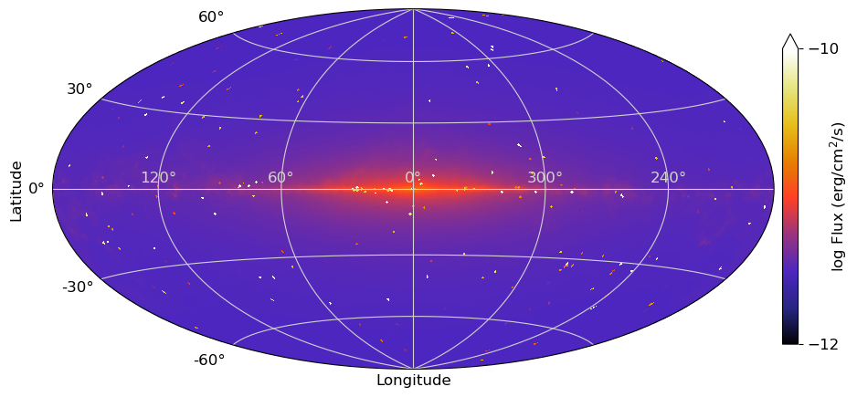 |  |  |
| 2  | Olrando 2018 DRE | 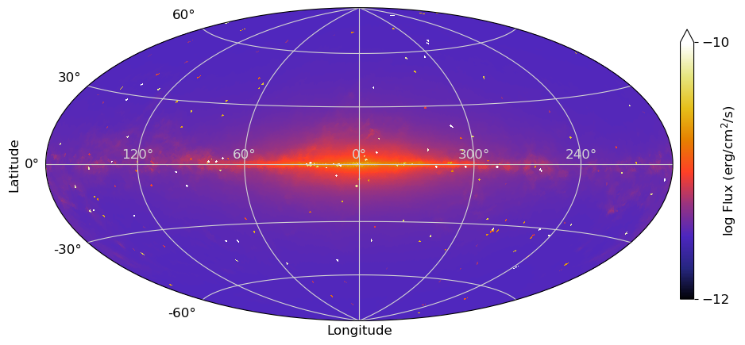 |  | 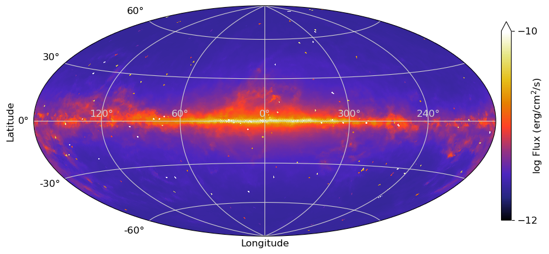 |
| 3  | Olrando 2018 DRELowV | 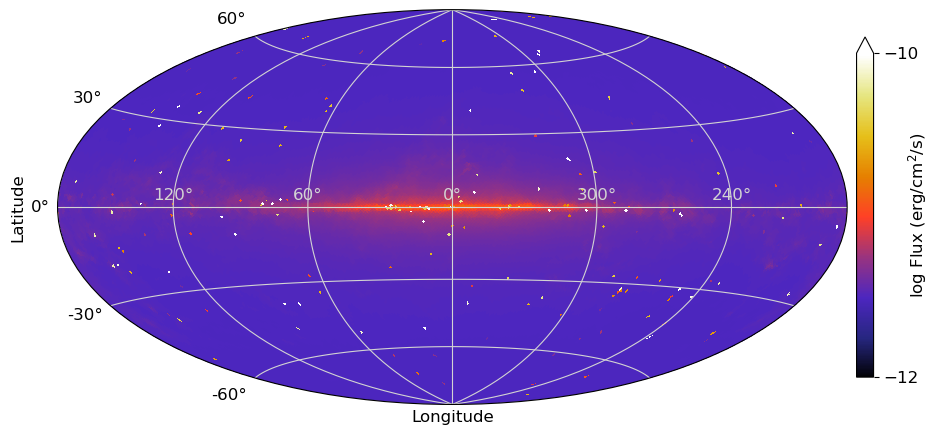 |  | 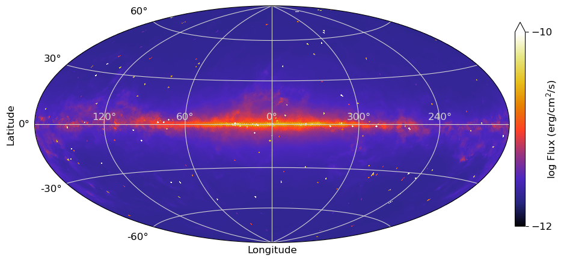 |
|   | **SMM** for CGB  |   |   |  COMPTEL is better in 10-100 MeV? | [total_allsky_2.zip](files/allsky/zip_total_SMMcgb/) |
| 1  | Ackermann+ 2012 | 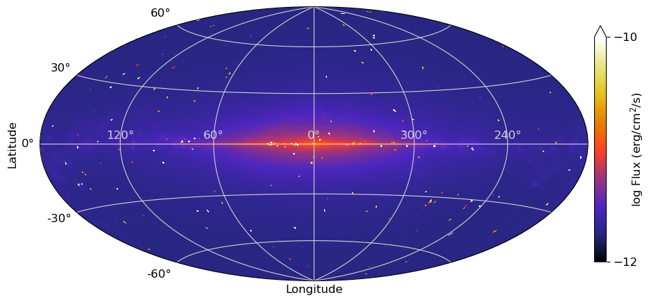 |  |  |
| 2  | Olrando 2018 DRE | 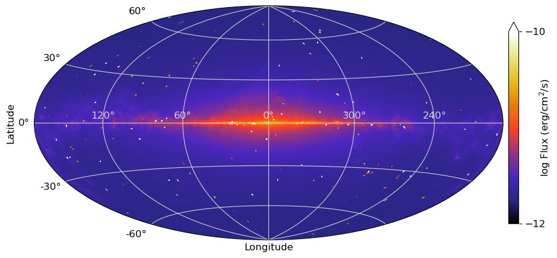 | 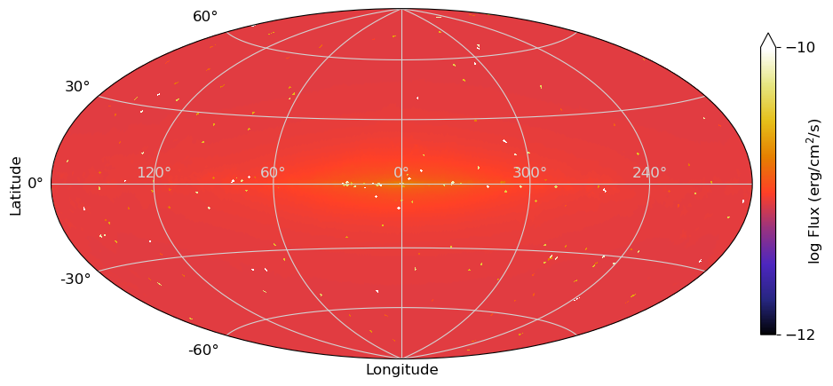 |  |
| 3  | Olrando 2018 DRELowV | 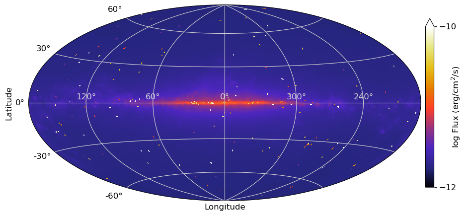 | 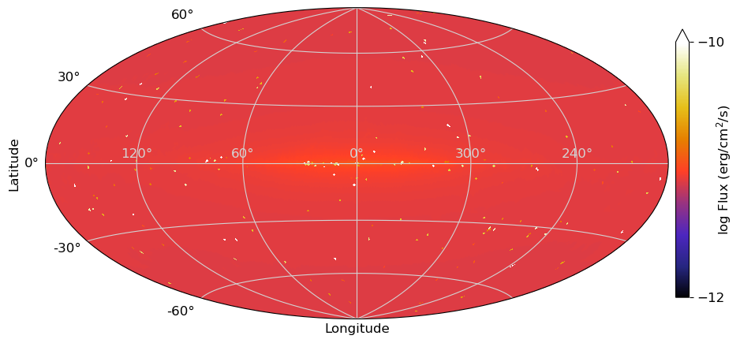 |  |

## Each component

| id | Notes | 1-10 MeV | 0.1-1 MeV | 10-100 MeV | FITS
| ---|---    | ---      | ---       | --- |---
|   | **Source**  |   |   |   |  [source.zip](files/allsky/zip_source/) |
| 1 | From the MeV catalog above. nside=64 |  | 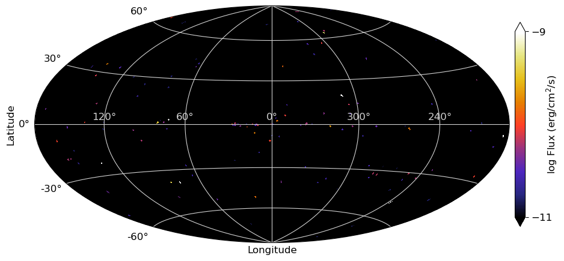 |   |
| 2 | nside=32 |  | 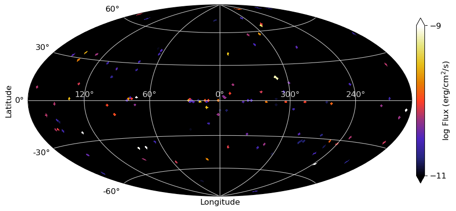 |  |
|   | **GDE**  |   |   |   | [GDE.zip](files/allsky/zip_GDE/) |
| 1  | `SS_Z4_R20_T150_C54` model in [Ackermann et al. 2012](https://iopscience.iop.org/article/10.1088/0004-637X/750/1/3). | 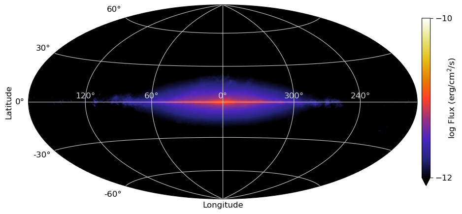 | 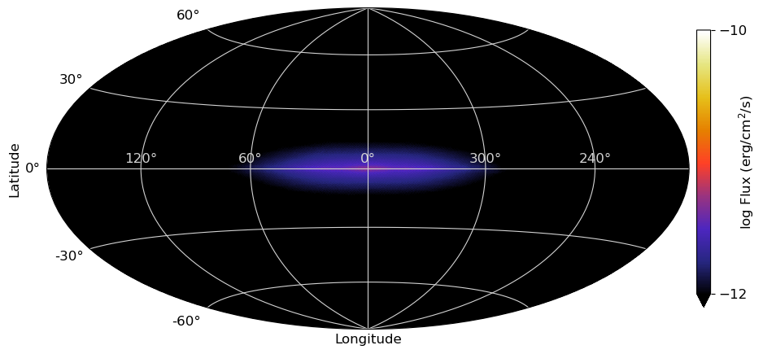 |  |
| 2  | DRE (diffusion and reacceleration) model in [Olrando 2018](http://doi.org/10.1093/mnras/stx3280) | 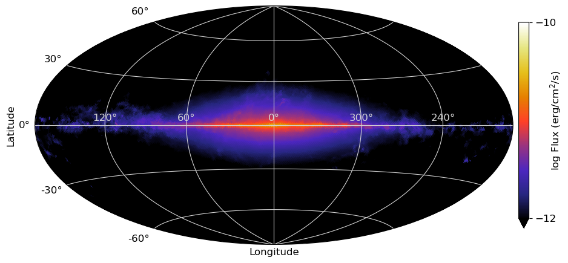 | 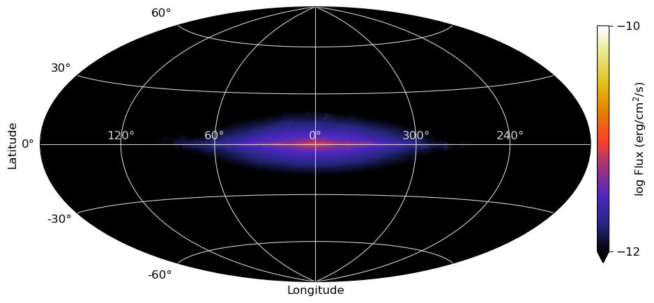 | 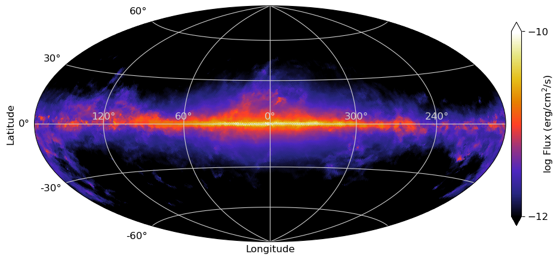 |
| 3  | DRELowV model [Olrando 2018](http://doi.org/10.1093/mnras/stx3280) |  | 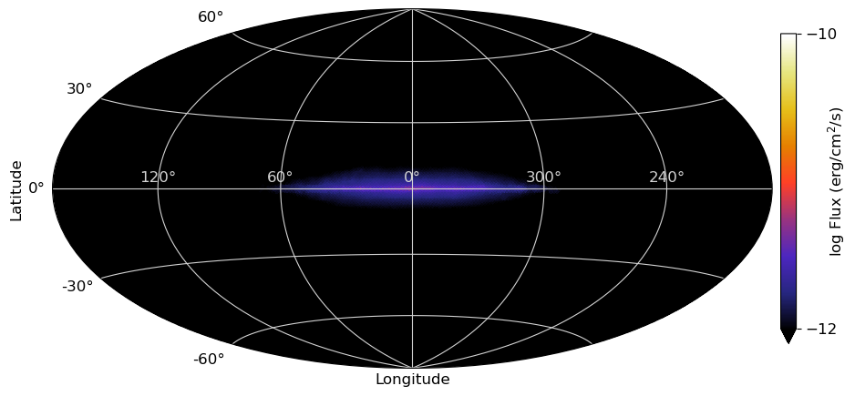 | 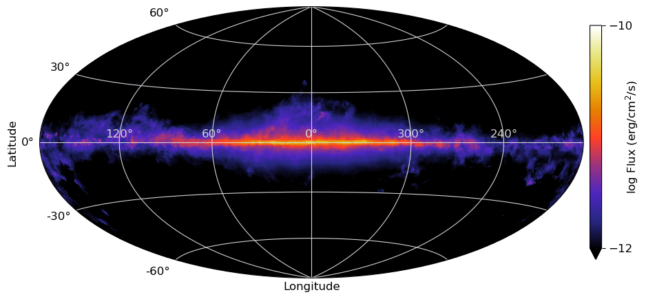 |
|   | **CGB**  |   |   |   | [CGB.zip](files/allsky/zip_CGB/) |
| 1 | COMPTEL | 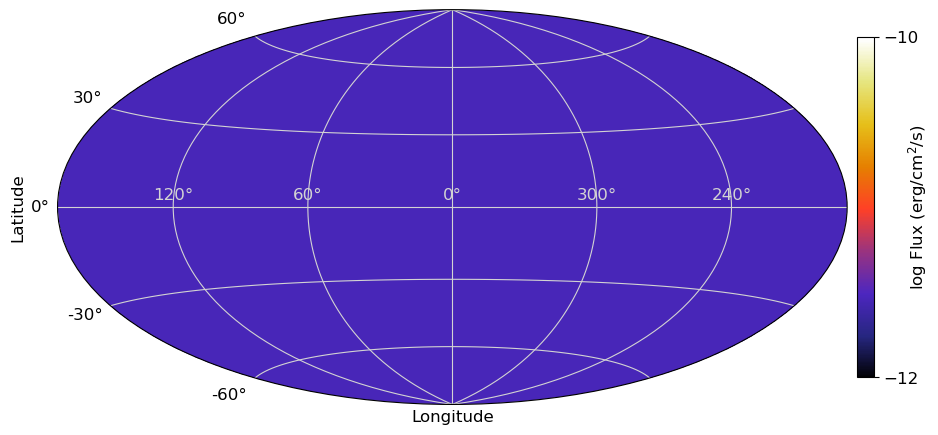 | 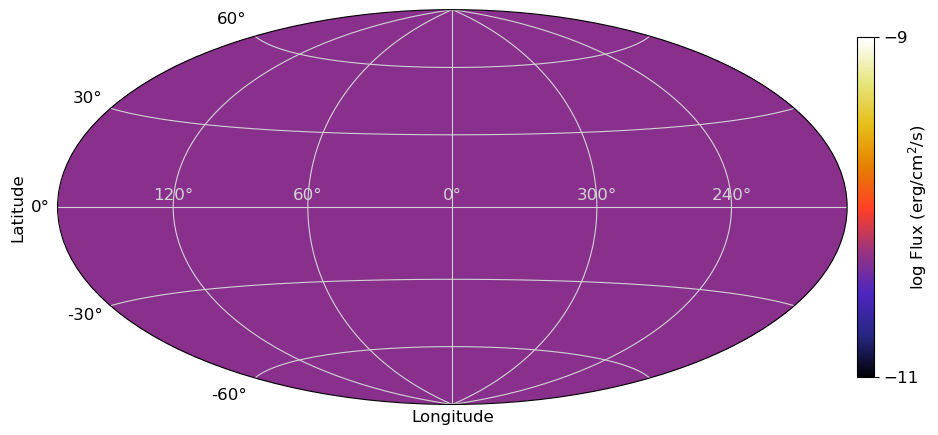 | 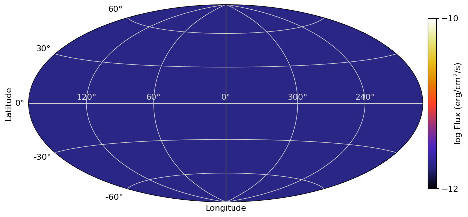|
| 2 | SMM |  | 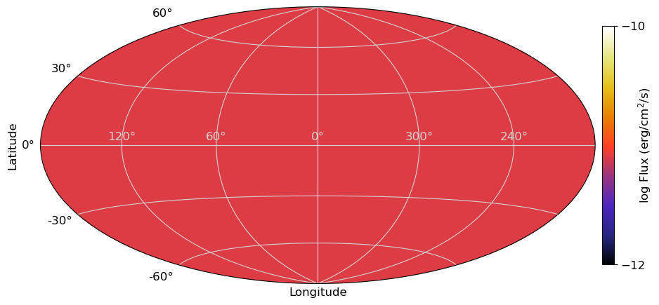 |  COMPTEL is better in >10 MeV ? |

-->

<!--
Preliminary page is [here](files/allsky/Table_allsky.md).

# MeV Gamma-ray All-Sky Map (ver.1)

- FITS file: [Allsky-fits-Model1](files/allsky/data_allsky_total_Ackermann.fits) (Model 1 for GDE)
- Flux is integrated over 1-10 MeV and in units of erg/cm2/s.
- HEALPix (<a href="https://healpix.sourceforge.io/">link</a> and <a href="https://healpy.readthedocs.io/en/latest/">HealPy</a>) format
  - Nside is 64

## 1. Galactic Diffuse Emission

| Model | Notes | Map | Galdef file | FITS fils |
|---|---|---|---|---|
| 1 | `SS_Z4_R20_T150_C54` model in [Ackermann et al. 2012](https://iopscience.iop.org/article/10.1088/0004-637X/750/1/3). |  | [galdef-1](files/allsky/galdef_54_0abb001h) | [GDE-fits-Model1](files/allsky/data_allsky_galactic_Ackermann.fits)
| 2 | DRE (diffusion and reacceleration) model in [Olrando 2018](http://doi.org/10.1093/mnras/stx3280) |  | [galdef-2](files/allsky/galdef_54_0abb001j) | [GDE-fits-Model2](files/allsky/data_allsky_total_Orlando_DRE.fits) |
| 3 | DRELowV model [Olrando 2018](http://doi.org/10.1093/mnras/stx3280) |  | [galdef-3](files/allsky/galdef_54_0abb001i) | [GDE-fits-Model3](files/allsky/data_allsky_total_Orlando_DREVlow.fits)|

## 2. MeV Gamma-ray Source

- FITS file: [Source-fits](files/allsky/data_allsky_source.fits)

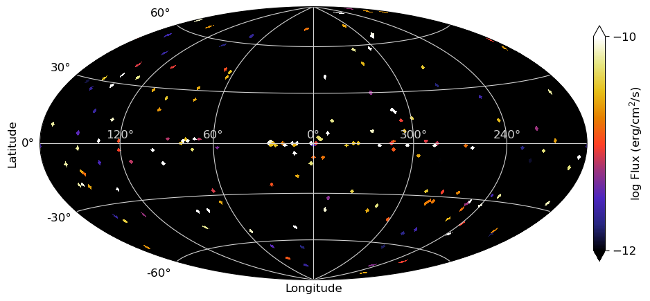

For visibility, nside of 32 is shown here.

## 3. Extragalactic Emission (Cosmic Gamma-ray Background)

- FITS file: [CGB-fits](files/allsky/data_cgb_source.fits)

-->

---
Please contact <ntsuji [at] kanagawa-u.ac.jp> about this page.

