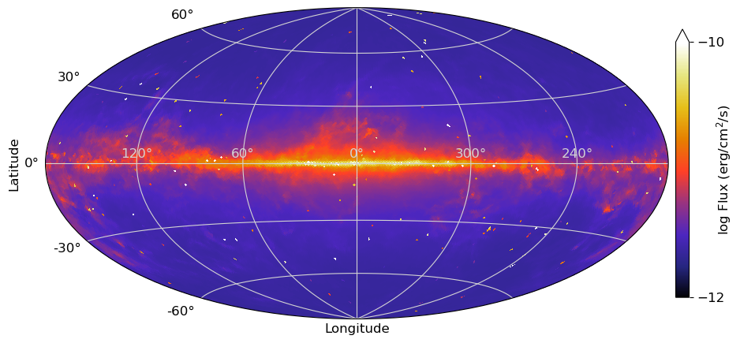
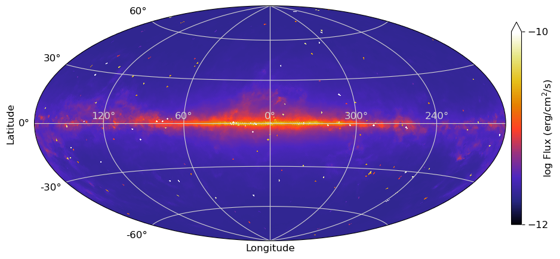
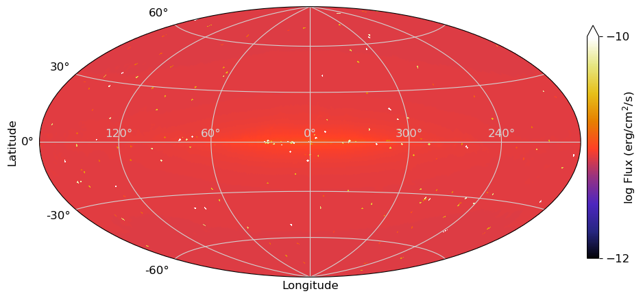
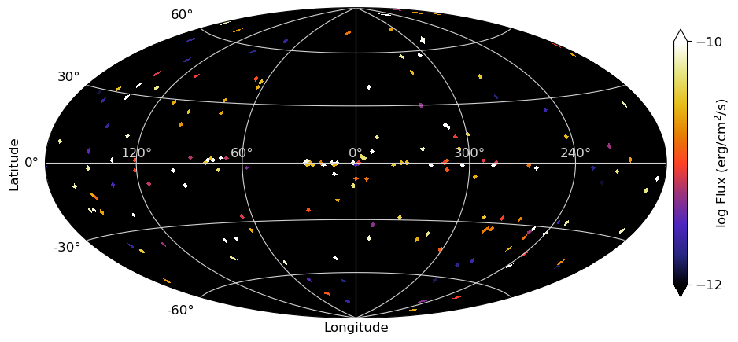
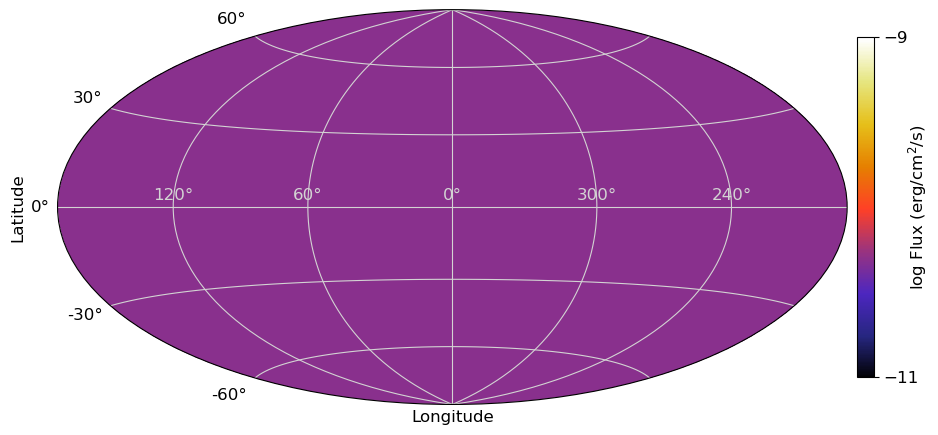
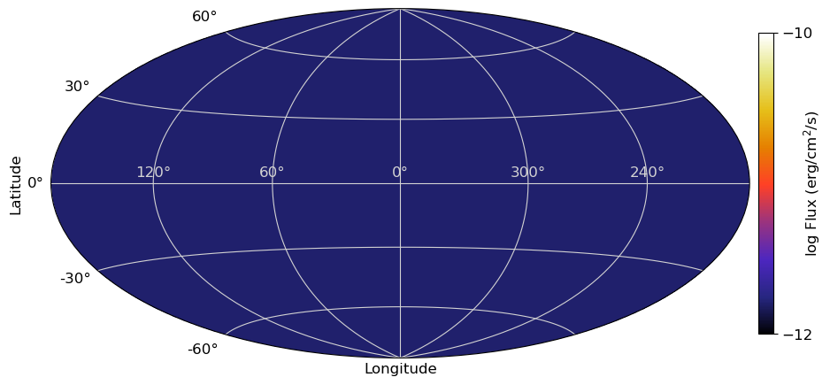
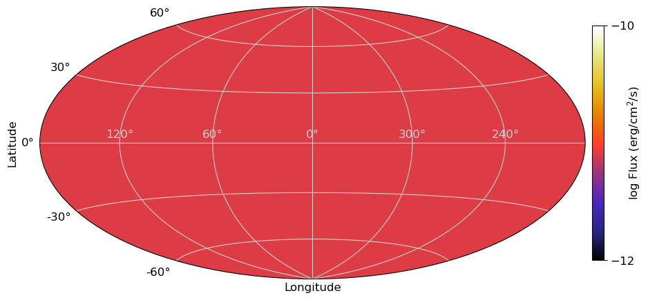

# another page

~~test~~
test.

## All-sky (total)

| id | Notes | 1-10 MeV | 0.1-1 MeV | 10-100 MeV | FITS
| ---|---    | ---      | ---       | --- |---
|   | **COMPTEL** for CGB  |   |   | |  [total_allsky.zip](files/allsky/zip_total_COMPTELcgb/) |
| 1  | Ackermann+ 2012 |  |  |  |
| 2  | Olrando 2018 DRE |  |  |  |
| 3  | Olrando 2018 DRELowV |  |  |  |
|   | **SMM** for CGB  |   |   |  COMPTEL is better in 10-100 MeV? | [total_allsky_2.zip](files/allsky/zip_total_SMMcgb/) |
| 1  | Ackermann+ 2012 |  |  |  |
| 2  | Olrando 2018 DRE |  |  |  |
| 3  | Olrando 2018 DRELowV |  |  |  |

## Each component

| id | Notes | 1-10 MeV | 0.1-1 MeV | 10-100 MeV | FITS
| ---|---    | ---      | ---       | --- |---
|   | **Source**  |   |   |   |  [source.zip](files/allsky/zip_source/) |
| 1 | From the MeV catalog above. nside=64 |  |  |   |
| 2 | nside=32 |  |  |  |
|   | **GDE**  |   |   |   | [GDE.zip](files/allsky/zip_GDE/) |
| 1  | `SS_Z4_R20_T150_C54` model in [Ackermann et al. 2012](https://iopscience.iop.org/article/10.1088/0004-637X/750/1/3). |  |  |  |
| 2  | DRE (diffusion and reacceleration) model in [Olrando 2018](http://doi.org/10.1093/mnras/stx3280) |  |  |  |
| 3  | DRELowV model [Olrando 2018](http://doi.org/10.1093/mnras/stx3280) |  |  |  |
|   | **CGB**  |   |   |   | [CGB.zip](files/allsky/zip_CGB/) |
| 1 | COMPTEL |  |  | |
| 2 | SMM |  |  |  COMPTEL is better in >10 MeV ? |

