## Point sources

|   id | Flag   | bat_name_counterpart       | bat_category_type   | fermi_name_counterpart   | fermi_name_counterpart2   | fermi_category_type   | coord_gal      |   LP_redchi2 |   BPL_redchi2 | SED_LP_________________                                                                        | SED_BPL_____________                                                                   | SED_2comp__________                                                | SED_user__________                                                           | Model   | mask_gal   |
|-----:|:-------|:---------------------------|:--------------------|:-------------------------|:--------------------------|:----------------------|:---------------|-------------:|--------------:|:------------------------------------------------------------------------------|:--------------------------------------------------------------------------|:---------------------------------------------------------|:-------------------------------------------------------------------|:--------|:-----------|
|    1 | M      | [HB89] 0537-441            | Beamed AGN          | PKS 0537-441             | nan                       | BLL                   | (250.1, -31.1) |          3.9 |          32.6 | 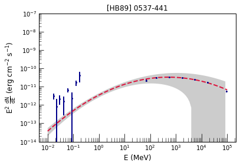            |             |             |             | LP      | False      |
|    2 | M      | [HB89] 0716+714            | Beamed AGN          | S5 0716+71               | nan                       | BLL                   | (144.0, 28.0)  |          5.1 |          42.2 | 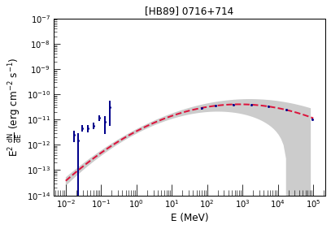            |             |             |             | LP      | False      |
|    3 | M      | Mrk 421                    | Beamed AGN          | Mkn 421                  | nan                       | BLL                   | (179.8, 65.0)  |         72.2 |           8.4 | 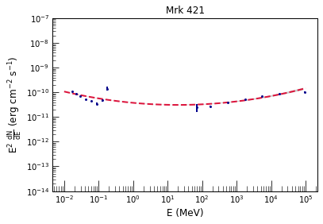                    |                     |                     |                     | LP      | False      |
|    4 | M      | Mrk 501                    | Beamed AGN          | Mkn 501                  | nan                       | BLL                   | (63.6, 38.9)   |          5.4 |           1.2 |                     | 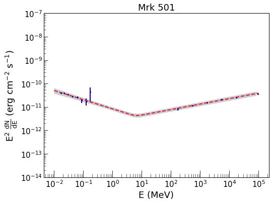                    |                     |                     | LP      | False      |
|    5 | M      | BL Lac                     | Beamed AGN          | BL Lac                   | nan                       | BLL                   | (92.6, -10.4)  |          3   |           8.5 |                      |                      |                      |                      | LP      | False      |
|    6 | M      | 1ES 0033+595               | Beamed AGN          | 1ES 0033+595             | nan                       | bll                   | (121.0, -3.0)  |          5.2 |           2.2 | 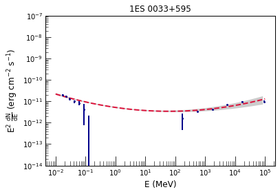               |                |                |                | LP      | False      |
|    7 | A      | 2MASX J01155048+2515369    | Sy1                 | RX J0115.7+2519          | nan                       | bll                   | (129.9, -37.2) |          1.1 |           1   | 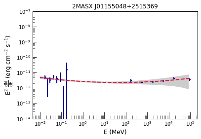    |     |     |     | LP      | False      |
|    8 | M      | SHBL J012308.7+342049      | Beamed AGN          | 1ES 0120+340             | nan                       | bll                   | (130.3, -28.1) |          1.2 |           1.3 |       | 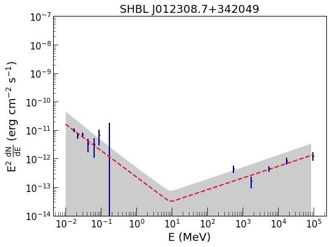      |       |       | LP      | False      |
|    9 | M      | B3 0133+388                | Beamed AGN          | B3 0133+388              | nan                       | bll                   | (132.4, -22.9) |          5.6 |          13.1 | 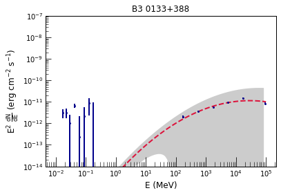                | 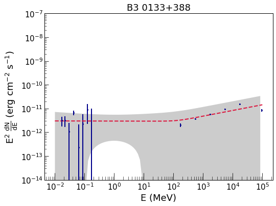                |                 |                 | LP      | False      |
|   10 | M      | RBS 259                    | Beamed AGN          | 1RXS J015658.6-530208    | nan                       | bll                   | (282.2, -61.4) |          3.3 |           2.8 |                     | 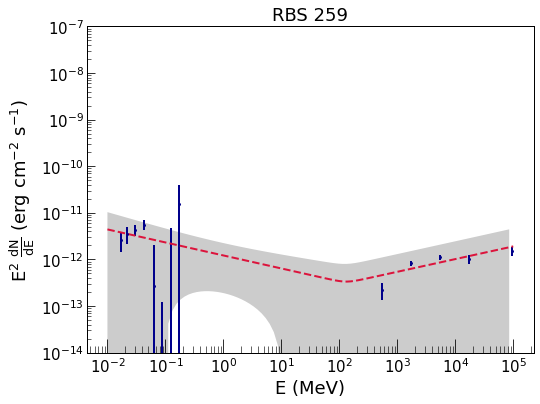                    |                     |                     | LP      | False      |
|   11 | M      | 2MASX J02141794+5144520    | Beamed AGN          | TXS 0210+515             | nan                       | bll                   | (135.8, -9.0)  |          0.9 |           1.1 |     | 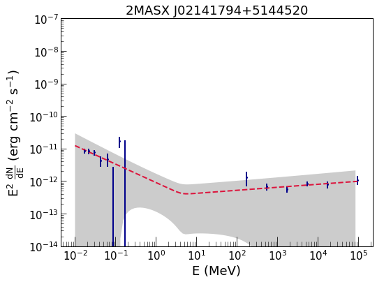    |     |     | LP      | False      |
|   12 | M      | QSO B0229+200              | Beamed AGN          | 1ES 0229+200             | nan                       | bll                   | (152.9, -36.6) |          1.2 |           0.9 | 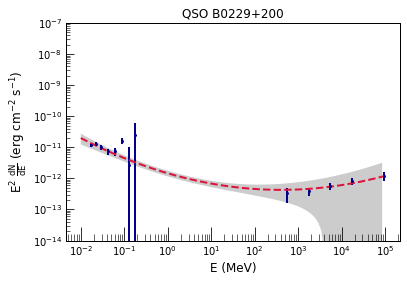              |               | 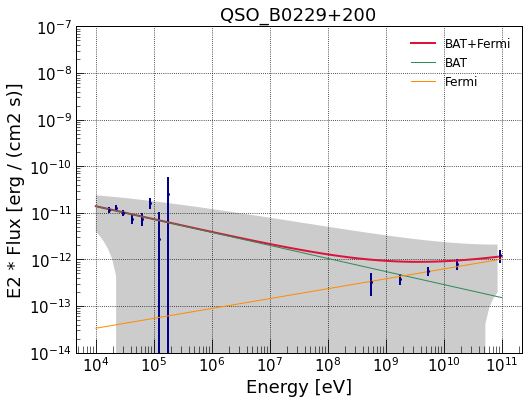              |               | LP      | False      |
|   13 | A      | ESO 416-G002               | Sy1.9               | PHL 1389                 | nan                       | bll                   | (225.4, -67.0) |          1.7 |           2   |                | 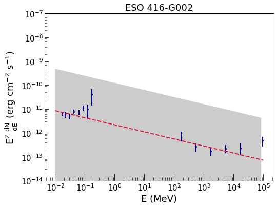               |                |                | LP      | False      |
|   14 | M      | BZB J0244-5819             | Beamed AGN          | RBS 0351                 | nan                       | bll                   | (278.4, -53.1) |          0.7 |           0.6 |              |              |              |              | LP      | False      |
|   15 | M      | QSO B0347-121              | Beamed AGN          | 1ES 0347-121             | nan                       | bll                   | (201.9, -45.7) |          2   |           1.5 | 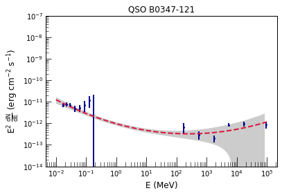              |               |               |               | LP      | False      |
|   16 | M      | PKS 0352-686               | Beamed AGN          | PKS 0352-686             | nan                       | bll                   | (282.8, -40.8) |          0.9 |           0.9 |                |                |                |                | LP      | False      |
|   17 | M      | PKS 0426-380               | Beamed AGN          | PKS 0426-380             | nan                       | bll                   | (240.7, -43.6) |          2.2 |         240.6 |                |                | 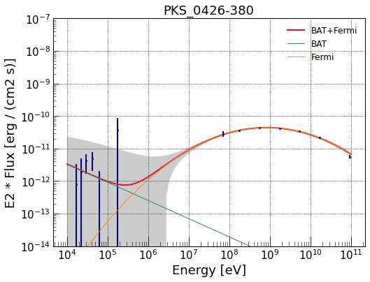               |                | LP      | False      |
|   18 | M      | PKS 0548-322               | Beamed AGN          | PKS 0548-322             | nan                       | bll                   | (237.6, -26.2) |          0.8 |           0.9 |                |                |                |                | LP      | False      |
|   19 | M      | PMN J0640-1253             | Beamed AGN          | TXS 0637-128             | nan                       | bll                   | (223.2, -8.3)  |          0.3 |           0.4 |              | 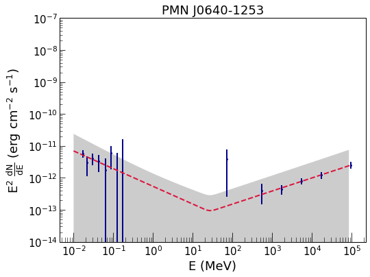             |              |              | LP      | False      |
|   20 | M      | 2MASX J07103005+5908202    | Beamed AGN          | 1H 0658+595              | nan                       | bll                   | (157.4, 25.4)  |          2.7 |           1.6 | 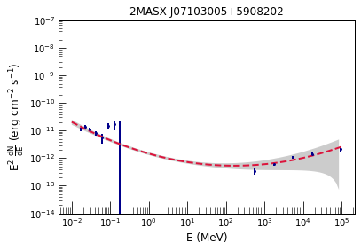    |     |     |     | LP      | False      |
|   21 | M      | 2MASS J09303759+4950256    | Beamed AGN          | 1ES 0927+500             | nan                       | bll                   | (168.1, 45.7)  |          1.1 |           1.3 |     | 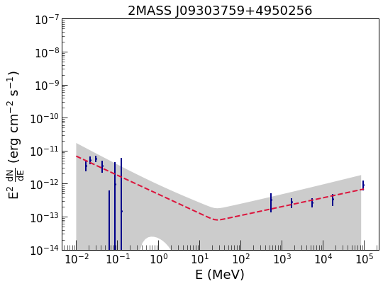    |     |     | LP      | False      |
|   22 | M      | 2MASS J09343014-1721215    | Beamed AGN          | RXC J0934.4-1721         | nan                       | bll                   | (250.2, 24.8)  |          0.8 |           0.8 | 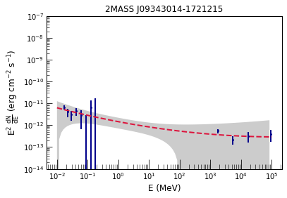    | 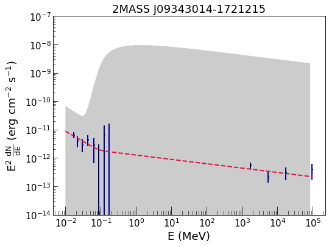    |     |     | LP      | False      |
|   23 | M      | 2MASX J10311847+5053358    | Beamed AGN          | 1ES 1028+511             | nan                       | bll                   | (161.4, 54.5)  |          1   |           0.7 | 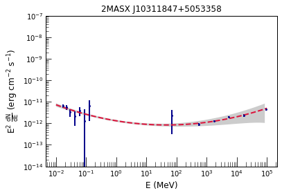    | 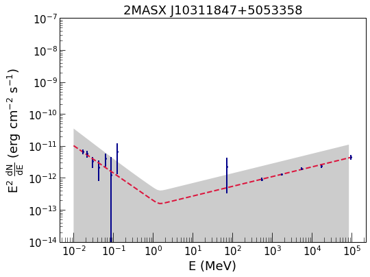    |     |     | LP      | False      |
|   24 | M      | 2MASX J11033765-2329307    | Beamed AGN          | 1ES 1101-232             | nan                       | bll                   | (273.2, 33.1)  |          0.7 |           0.9 |     |     |     |     | LP      | False      |
|   25 | M      | 2MASX J11363009+6737042    | Beamed AGN          | RX J1136.5+6737          | nan                       | bll                   | (133.5, 48.0)  |          0.9 |           0.7 | 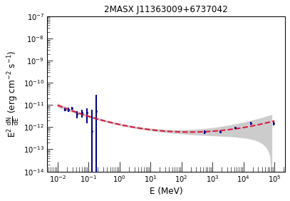    |     |     |     | LP      | False      |
|   26 | M      | FBQS J1221+3010            | Beamed AGN          | PG 1218+304              | nan                       | bll                   | (186.4, 82.7)  |          1.5 |           0.6 | 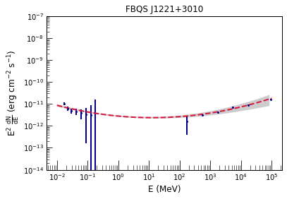            |             |             |             | LP      | False      |
|   27 | M      | [HB89] 1415+259            | Beamed AGN          | 1E 1415.6+2557           | nan                       | bll                   | (33.7, 70.6)   |          0.6 |           0.6 |             | 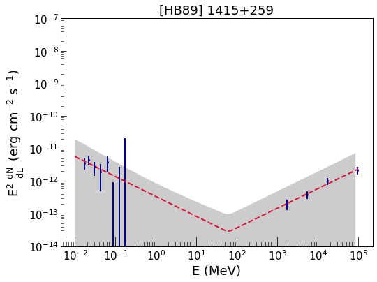            |             |             | LP      | False      |
|   28 | M      | 1ES 1426+428               | Beamed AGN          | H 1426+428               | nan                       | bll                   | (77.5, 64.9)   |          1.1 |           0.8 |                | 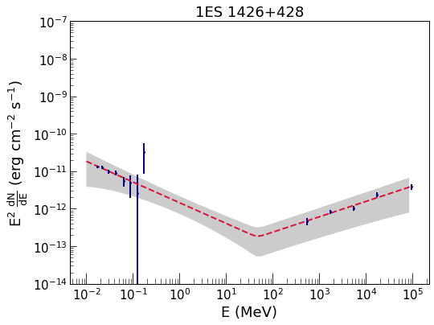               |                |                | LP      | False      |
|   29 | M      | [HB89] 1803+784            | Beamed AGN          | S5 1803+784              | nan                       | bll                   | (110.0, 29.1)  |          2.4 |           8.7 |             | 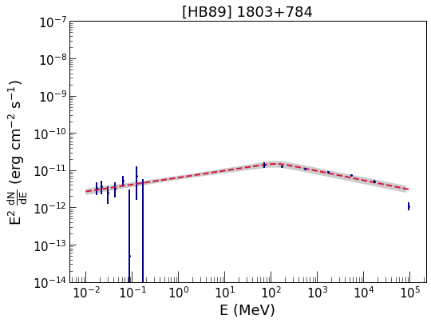            |             |             | LP      | False      |
|   30 | M      | QSO B1959+650              | Beamed AGN          | 1ES 1959+650             | nan                       | bll                   | (98.0, 17.7)   |          9.3 |           3.7 |               | 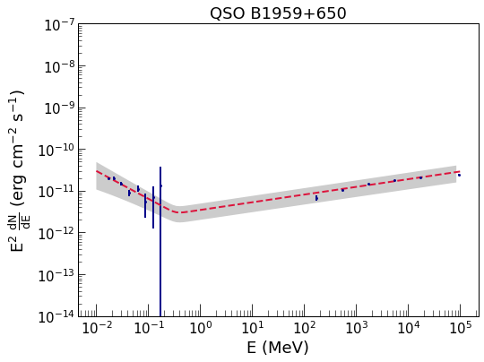              |               |               | LP      | False      |
|   31 | M      | 2MASX J23470479+5142179    | Beamed AGN          | 1ES 2344+514             | nan                       | bll                   | (112.9, -9.9)  |          4.4 |           3   |     | 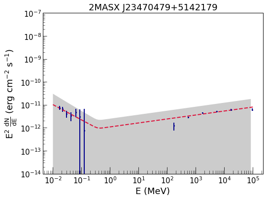    |     |     | LP      | False      |
|   32 | M      | H 2356-309                 | Beamed AGN          | H 2356-309               | nan                       | bll                   | (12.8, -78.0)  |          0.5 |           0.3 | 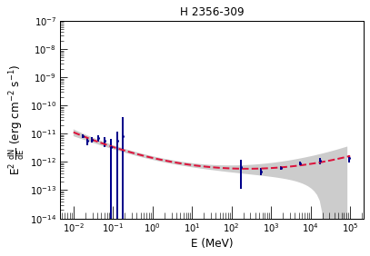                 |                  |                  |                  | LP      | False      |
|   33 | M      | 3C 454.3                   | Beamed AGN          | 3C 454.3                 | nan                       | FSRQ                  | (86.1, -38.2)  |         65.5 |         372.4 |                    |                    |                    |                    | LP      | False      |
|   34 | M      | [HB89] 2230+114            | Beamed AGN          | CTA 102                  | nan                       | FSRQ                  | (77.4, -38.6)  |         16.9 |         207.6 | 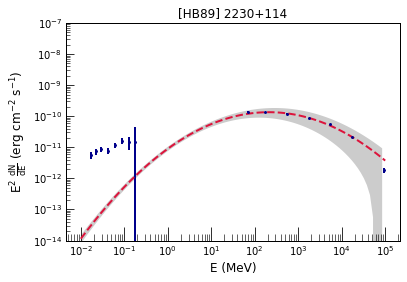            | 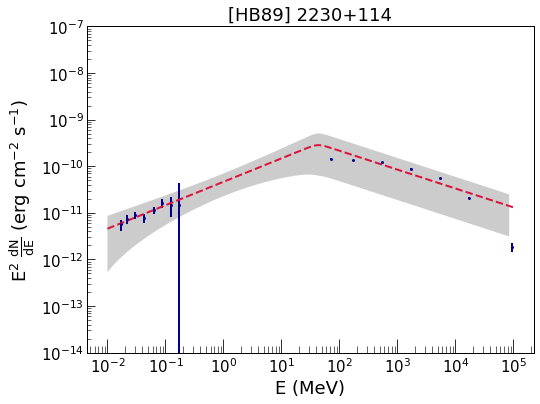            |             |             | LP      | False      |
|   35 | M      | PKS 2227-088               | Beamed AGN          | PKS 2227-08              | nan                       | FSRQ                  | (55.2, -51.7)  |          1.3 |           7.2 |                | 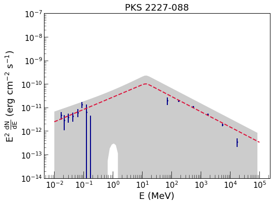               |                |                | LP      | False      |
|   36 | M      | [HB89] 2142-758            | Beamed AGN          | PKS 2142-75              | nan                       | FSRQ                  | (315.8, -36.5) |          1.1 |          10.5 |             |             |             |             | LP      | False      |
|   37 | M      | QSO B2013+370              | Beamed AGN          | MG2 J201534+3710         | nan                       | FSRQ                  | (74.9, 1.2)    |          3.6 |           1.2 |               |               |               |               | LP      | False      |
|   38 | M      | PKS 1830-21                | Beamed AGN          | PKS 1830-211             | nan                       | FSRQ                  | (12.2, -5.7)   |          6.2 |          47.1 |                 |                 |                 |                 | LP      | True       |
|   39 | M      | 3C 345                     | Beamed AGN          | 3C 345                   | nan                       | FSRQ                  | (63.5, 41.0)   |          1.1 |           0.8 |                      | 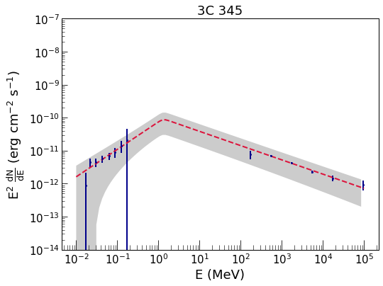                     |                      |                      | LP      | False      |
|   40 | M      | PKS 1622-29                | Beamed AGN          | PKS B1622-297            | nan                       | FSRQ                  | (348.8, 13.3)  |          1.3 |           4.6 |                 | 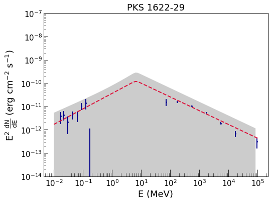                |                 |                 | LP      | False      |
|   41 | M      | PKS 1510-08                | Beamed AGN          | PKS 1510-089             | nan                       | FSRQ                  | (351.3, 40.1)  |          0.4 |          21   |                 |                 |                 |                 | LP      | False      |
|   42 | M      | 3C 279                     | Beamed AGN          | 3C 279                   | nan                       | FSRQ                  | (305.1, 57.1)  |          6   |          88.2 |                      |                      |                      |                      | LP      | False      |
|   43 | M      | 3C 273                     | Beamed AGN          | 3C 273                   | nan                       | FSRQ                  | (289.9, 64.4)  |          9.5 |          15.8 |                      |                      |                      |                      | LP      | False      |
|   44 | M      | PG 1222+216                | Beamed AGN          | 4C +21.35                | nan                       | FSRQ                  | (255.1, 81.7)  |          1.6 |          10.4 |                 |                 |                 |                 | LP      | False      |
|   45 | M      | 4C +49.22                  | Beamed AGN          | 4C +49.22                | nan                       | FSRQ                  | (145.6, 65.0)  |          1.9 |           3.2 | 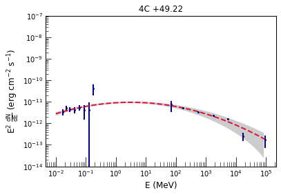                  |                   |                   |                   | LP      | False      |
|   46 | M      | [HB89] 0836+710            | Beamed AGN          | 4C +71.07                | nan                       | FSRQ                  | (143.5, 34.4)  |         18.8 |          28.1 | 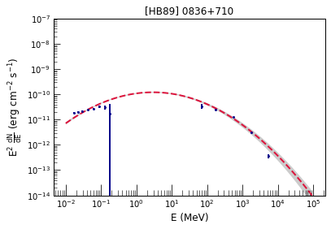            |             |             |             | LP      | False      |
|   47 | M      | PMN J0641-0320             | Beamed AGN          | PMN J0641-0320           | nan                       | FSRQ                  | (214.8, -3.7)  |          1.7 |           3   |              |              |              |              | LP      | False      |
|   48 | M      | PKS 0528+134               | Beamed AGN          | PKS 0528+134             | nan                       | FSRQ                  | (191.4, -11.0) |          2.9 |           5.7 |                | 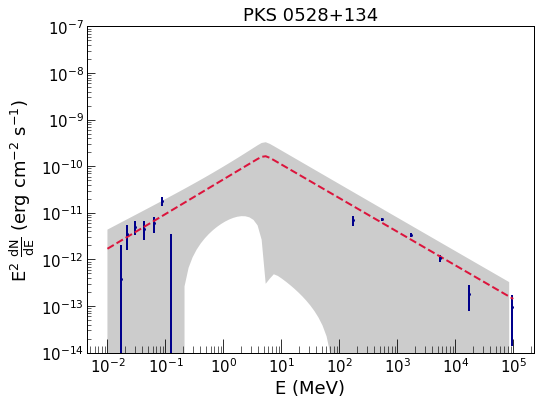               |                |                | LP      | False      |
|   49 | M      | PKS 0402-362               | Beamed AGN          | PKS 0402-362             | nan                       | FSRQ                  | (237.7, -48.5) |          4.1 |          35.4 |                |                |                |                | LP      | False      |
|   50 | M      | PKS 2325+093               | Beamed AGN          | PKS 2325+093             | nan                       | fsrq                  | (91.1, -48.0)  |          0.8 |           1.6 | 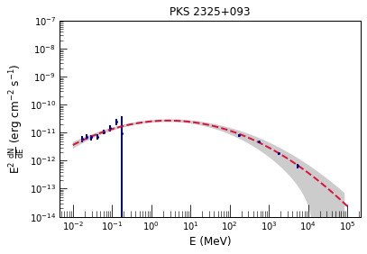               |                |                |                | LP      | False      |
|   51 | M      | 87GB 215950.2+503417       | Beamed AGN          | NRAO 676                 | nan                       | fsrq                  | (97.7, -3.5)   |          3   |           9   |        |        |        |        | LP      | False      |
|   52 | M      | PKS 2149-306               | Beamed AGN          | PKS 2149-306             | nan                       | fsrq                  | (17.1, -50.8)  |          4.4 |          10.5 |                |                |                |                | LP      | False      |
|   53 | M      | [HB89] 1921-293            | Beamed AGN          | PKS B1921-293            | nan                       | fsrq                  | (9.3, -19.6)   |          0.8 |           0.7 | 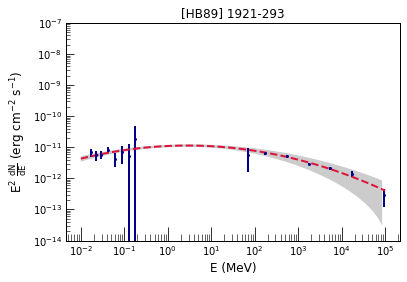            |             |             |             | LP      | False      |
|   54 | M      | 2MASS J16561677-3302127    | Beamed AGN          | 2MASS J16561677-3302127  | nan                       | fsrq                  | (350.6, 6.4)   |          0.5 |           1.3 |     |     |     |     | LP      | True       |
|   55 | M      | [HB89] 1354+195            | Beamed AGN          | 4C +19.44                | nan                       | fsrq                  | (9.2, 73.0)    |          1.2 |           1.1 | 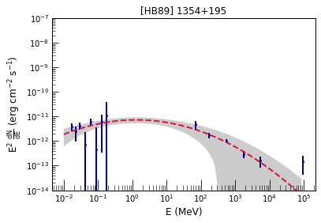            |             |             |             | LP      | False      |
|   56 | M      | [HB89] 1334-127            | Beamed AGN          | PKS 1335-127             | nan                       | fsrq                  | (320.0, 48.4)  |          2.1 |           0.7 | 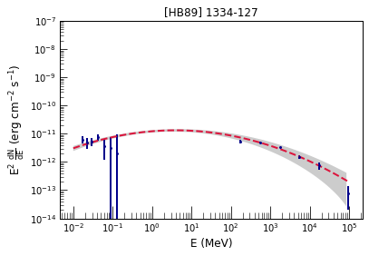            | 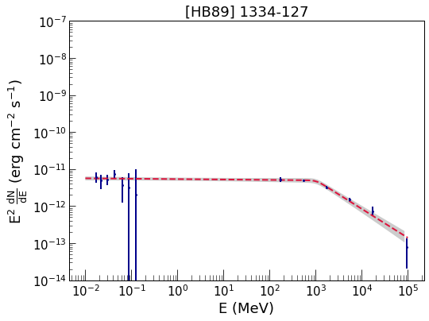            |             |             | LP      | False      |
|   57 | M      | PKS 1329-049               | Beamed AGN          | PKS 1329-049             | nan                       | fsrq                  | (321.4, 56.2)  |          3.9 |          10   |                | 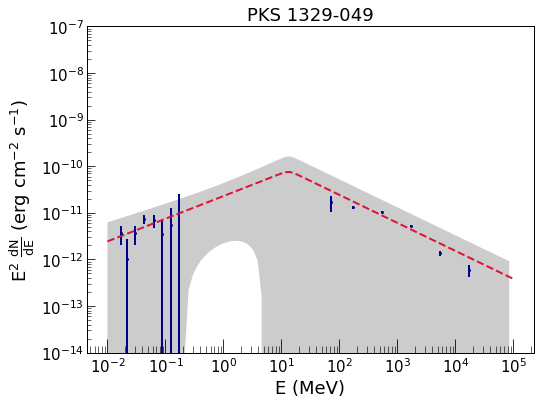               |                |                | LP      | False      |
|   58 | U      | SWIFT J1254.9+1165         | U3                  | ON 187                   | nan                       | fsrq                  | (306.1, 74.5)  |          0.9 |           1.1 |          |          |          |          | LP      | False      |
|   59 | M      | 4C +04.42                  | Beamed AGN          | 4C +04.42                | nan                       | fsrq                  | (284.9, 66.1)  |          0.7 |           1.9 |                   |                   |                   |                   | LP      | False      |
|   60 | M      | FBQS J1159+2914            | Beamed AGN          | Ton 599                  | nan                       | fsrq                  | (199.4, 78.4)  |          2.1 |           9.4 |             |             |             |             | LP      | False      |
|   61 | M      | 7C 1150+3324               | Beamed AGN          | B2 1150+33A              | nan                       | fsrq                  | (184.0, 76.0)  |          1.7 |           1.4 |                |                |                |                | LP      | False      |
|   62 | M      | PKS 1143-696               | Beamed AGN          | PKS 1143-696             | nan                       | fsrq                  | (297.3, -7.7)  |          0.3 |           0.2 |                |                |                |                | LP      | False      |
|   63 | M      | PKS 1127-14                | Beamed AGN          | PKS 1127-14              | nan                       | fsrq                  | (275.2, 43.6)  |          0.5 |           0.4 | 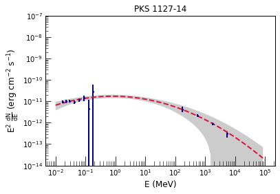                | 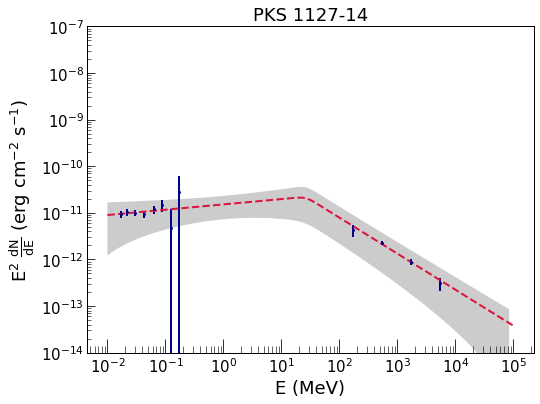                |                 |                 | LP      | False      |
|   64 | M      | [HB89] 1039+811            | Beamed AGN          | S5 1039+81               | nan                       | fsrq                  | (128.7, 34.8)  |          3.8 |           5.7 |             |             |             |             | LP      | False      |
|   65 | U      | SWIFT J0949.1+4057         | confused source     | 4C +40.24                | nan                       | fsrq                  | (181.0, 50.3)  |          1.8 |           1.6 |          |          |          |          | LP      | False      |
|   66 | M      | CGRaBS J0805+6144          | Beamed AGN          | TXS 0800+618             | nan                       | fsrq                  | (155.0, 32.4)  |          0.8 |           1.6 | 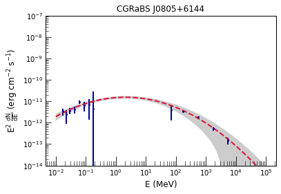          | 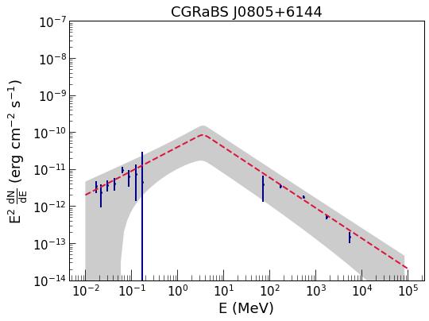          |           |           | LP      | False      |
|   67 | M      | B2 0743+25                 | Beamed AGN          | B2 0743+25               | nan                       | fsrq                  | (194.6, 22.9)  |          1.4 |           2.4 | 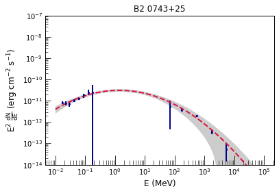                 |                  |                  |                  | LP      | False      |
|   68 | M      | PKS 0637-752               | Beamed AGN          | PKS 0637-75              | nan                       | fsrq                  | (286.4, -27.2) |          1.1 |           1.2 |                |                |                |                | LP      | False      |
|   69 | M      | [HB89] 0552+398            | Beamed AGN          | B2 0552+39A              | nan                       | fsrq                  | (171.7, 7.3)   |          2.1 |           3.9 |             |             |             |             | LP      | False      |
|   70 | M      | [HB89] 0537-286            | Beamed AGN          | PKS 0537-286             | nan                       | fsrq                  | (232.9, -27.3) |          0.7 |           2.3 |             |             |             |             | LP      | False      |
|   71 | M      | PKS 0524-460               | Beamed AGN          | PKS 0524-460             | nan                       | fsrq                  | (252.0, -33.7) |          1.6 |           0.9 |                |                |                |                | LP      | False      |
|   72 | M      | [HB89] 0403-132            | Beamed AGN          | PKS 0403-13              | nan                       | fsrq                  | (205.8, -42.6) |          0.9 |           0.8 |             |             |             |             | LP      | False      |
|   73 | M      | 4C +50.11                  | Beamed AGN          | NRAO 150                 | nan                       | fsrq                  | (150.4, -1.6)  |          1.1 |           3.3 |                   |                   |                   |                   | LP      | False      |
|   74 | M      | [HB89] 0212+735            | Beamed AGN          | S5 0212+73               | nan                       | fsrq                  | (128.9, 12.0)  |          1.5 |           2   |             |             |             |             | LP      | False      |
|   75 | U      | PMN J0145-2733             | Unknown AGN         | PKS 0142-278             | nan                       | fsrq                  | (218.0, -78.1) |          1.9 |           4.2 |              |              |              |              | LP      | False      |
|   76 | A      | ESO 354- G 004             | Sy1.9               | PMN J0151-3605           | nan                       | bcu                   | (251.9, -74.4) |          0.6 |           0.9 |              |              |              |              | LP      | False      |
|   77 | M      | 4C +33.06                  | Beamed AGN          | 4C +33.06                | nan                       | bcu                   | (152.2, -21.4) |          0.6 |           0.5 |                   |                   |                   |                   | LP      | False      |
|   78 | M      | PKS 0706-15                | Beamed AGN          | PKS 0706-15              | nan                       | bcu                   | (228.7, -3.1)  |          1   |           0.7 |                 |                 |                 |                 | LP      | False      |
|   79 | M      | PKS 0723-008               | Beamed AGN          | PKS 0723-008             | nan                       | bcu                   | (217.7, 7.2)   |          1.1 |           1.3 |                |                |                |                | LP      | False      |
|   80 | M      | 2MASX J07332681+5153560    | Beamed AGN          | NVSS J073326+515355      | nan                       | bcu                   | (166.0, 27.3)  |          1.1 |           1.2 |     |     |     |     | LP      | False      |
|   81 | D      | IGR J13109-5552            | Sy1                 | PMN J1310-5552           | nan                       | bcu                   | (305.7, 6.9)   |          0.8 |           0.9 |             |             |             |             | LP      | True       |
|   82 | M      | PMN J1508-4953             | Beamed AGN          | PMN J1508-4953           | nan                       | bcu                   | (324.4, 7.2)   |          0.8 |           1   |              |              |              |              | LP      | True       |
|   83 | D      | SGR A*                     | Galactic Center     | Galactic Centre          | nan                       | bcu                   | (360.0, -0.0)  |         33.7 |         142.5 |                      |                      |                      |                      | 2comp   | True       |
|   84 | M      | PKS 1936-623               | Beamed AGN          | PKS 1936-623             | nan                       | bcu                   | (334.5, -29.5) |          1.1 |           8   |                |                |                |                | LP      | False      |
|   85 | M      | SWIFT J1943536.21+211822.9 | Beamed AGN          | MG2 J194359+2118         | nan                       | bcu                   | (57.8, -1.3)   |          2.2 |           1.4 |  |  |  |  | LP      | True       |
|   86 | M      | B2 2023+33                 | Beamed AGN          | B2 2023+33               | nan                       | bcu                   | (73.1, -2.4)   |          0.7 |           1   |                  |                  |                  |                  | LP      | False      |
|   87 | M      | RX J2056.6+4940            | Beamed AGN          | RGB J2056+496            | nan                       | bcu                   | (89.3, 2.8)    |          1.2 |           0.8 |             |             |             |             | LP      | False      |
|   88 | M      | RBS 1895                   | Beamed AGN          | RBS 1895                 | nan                       | bcu                   | (337.4, -55.8) |          0.4 |           0.4 |                    |                    |                    |                    | LP      | False      |
|   89 | M      | 1RXS J225146.9-320614      | Beamed AGN          | 1RXS J225146.9-320614    | nan                       | bcu                   | (14.7, -63.6)  |          1.2 |           1.1 |       |       |       |       | LP      | False      |
|   90 | M      | PKS 0521-36                | Beamed AGN          | PKS 0521-36              | nan                       | AGN                   | (240.6, -32.7) |          4.5 |           7.3 |                 |                 |                 |                 | LP      | False      |
|   91 | M      | Cen A                      | Beamed AGN          | Cen A                    | CenA Lobes field          | RDG                   | (309.5, 19.4)  |         14.5 |           3.6 |                       |                       |                       |                       | LP      | False      |
|   92 | M      | 3C 120                     | Beamed AGN          | 3C 120                   | nan                       | RDG                   | (190.3, -27.4) |          4.1 |           3.6 |                      |                      |                      |                      | LP      | False      |
|   93 | M      | NGC 1275                   | Beamed AGN          | NGC 1275                 | nan                       | RDG                   | (150.6, -13.3) |        217.5 |         221.6 |                    |                    |                    |                    | LP      | False      |
|   94 | M      | PKS 2300-18                | Beamed AGN          | PKS 2300-18              | nan                       | rdg                   | (45.8, -63.7)  |          0.9 |           1.8 |                 |                 |                 |                 | LP      | False      |
|   95 | D      | 3C 303                     | Sy1                 | 3C 303                   | nan                       | rdg                   | (90.5, 57.5)   |          0.5 |           0.6 |                      |                      |                      |                      | LP      | False      |
|   96 | D      | PICTOR A                   | Sy2                 | Pictor A                 | nan                       | rdg                   | (251.6, -34.7) |          1.2 |           1.2 |                    |                    |                    |                    | LP      | False      |
|   97 | M      | QSO B0309+411              | Beamed AGN          | B3 0309+411B             | nan                       | rdg                   | (149.6, -14.1) |          0.9 |           0.9 |               |               |               |               | LP      | False      |
|   98 | D      | NGC 4945                   | Sy2                 | NGC 4945                 | nan                       | sbg                   | (305.3, 13.3)  |         46.8 |         284   |                    |                    |                    |                    | LP      | False      |
|   99 | M      | M 82                       | Starburst galaxy    | M 82                     | nan                       | sbg                   | (141.4, 40.6)  |          2.4 |           5.8 |                        |                        |                        |                        | LP      | False      |
|  100 | D      | NGC 1068                   | Sy1.9               | NGC 1068                 | nan                       | sbg                   | (172.1, -51.9) |          3.8 |           6.2 |                    |                    |                    |                    | LP      | False      |
|  101 | M      | Circinus Galaxy            | Sy2                 | Circinus galaxy          | nan                       | sey                   | (311.3, -3.8)  |          8   |         197   |             |             |             |             | User    | True       |
|  102 | M      | 1H 0323+342                | Beamed AGN          | 1H 0323+342              | nan                       | nlsy1                 | (155.7, -18.7) |          1.2 |           1   |                 |                 |                 |                 | LP      | False      |
|  103 | M      | 3C 380                     | Beamed AGN          | 3C 380                   | nan                       | css                   | (77.2, 23.5)   |          1.3 |           2.4 |                      |                      |                      |                      | LP      | False      |
|  104 | M      | Cas A                      | SNR                 | Cas A                    | nan                       | snr                   | (111.7, -2.1)  |         63.6 |           8.8 |                       |                       |                       |                       | LP      | False      |
|  105 | M      | Tycho SNR                  | SNR                 | Tycho                    | nan                       | snr                   | (120.1, 1.4)   |          4.1 |           3   |                   |                   |                   |                   | LP      | False      |
|  106 | D      | SNR G068.8+02.6            | SNR                 | PSR J1952+3252           | nan                       | PSR                   | (68.8, 2.8)    |          5   |          16.1 |             |             |             |             | LP      | False      |
|  107 | D      | SNR G21.5-00.9             | SNR                 | PSR J1833-1034           | nan                       | PSR                   | (21.5, -0.9)   |         15.8 |          46.5 |              |              |              |              | 2comp   | True       |
|  108 | F      | 4U 1820-30                 | LMXB                | PSR J1823-3021A          | nan                       | PSR                   | (2.8, -7.9)    |         45.4 |        4930.4 |                  |                  |                  |                  | 2comp   | True       |
|  109 | F      | SLX 1744-299               | LMXB                | PSR J1747-2958           | nan                       | PSR                   | (359.3, -0.8)  |        106.3 |         112.1 |                |                |                |                | 2comp   | True       |
|  110 | D      | 1RXS J122758.8-485343      | CV                  | PSR J1227-4853           | nan                       | PSR                   | (299.0, 13.8)  |          2.3 |           3.4 |       |       |       |       | LP      | False      |
|  111 | M      | PSR J1124-5916             | Pulsar              | PSR J1124-5916           | nan                       | PSR                   | (292.0, 1.8)   |          3.6 |           1.2 |              |              |              |              | LP      | False      |
|  112 | M      | Vela Pulsar                | Pulsar              | PSR J0835-4510           | Vela X field              | PSR                   | (263.6, -2.8)  |       2093   |         895.6 |                 |                 |                 |                 | LP      | False      |
|  113 | M      | PSR B0540-69               | Pulsar              | PSR J0540-6919           | LMC-Galaxy field          | PSR                   | (279.7, -31.5) |          2.9 |           2.8 |                |                |                |                | LP      | False      |
|  114 | F      | 2MASX J04372814-4711298    | Sy1                 | PSR J0437-4715           | nan                       | PSR                   | (253.4, -42.0) |         34.5 |           2.3 |     |     |     |     | LP      | False      |
|  115 | M      | PSR J1811-1925             | Pulsar              | PSR J1811-1925           | HESS J1809-193 field      | psr                   | (11.2, -0.4)   |          1.3 |           1.2 |              |              |              |              | LP      | True       |
|  116 | M      | Crab                       | Pulsar              | Crab Nebula$^\dagger$    | nan                       | PWN                   | (184.6, -5.8)  |        976.9 |         177.1 |                        |                        |                        |                        | LP      | False      |
|  117 | F      | IGR J17461-2853            | molecular cloud     | PWN G0.13-0.11           | nan                       | pwn                   | (0.2, -0.1)    |          9.1 |          15.3 |             |             |             |             | LP      | True       |
|  118 | M      | Cyg X-3                    | HMXB                | Cyg X-3                  | Cygnus Cocoon field       | HMB                   | (79.8, 0.6)    |         83.2 |         168.3 |                     |                     |                     |                     | LP      | False      |
|  119 | M      | RX J1826.2-1450            | HMXB                | LS 5039                  | nan                       | HMB                   | (16.9, -1.3)   |          5   |          13.4 |             |             |             |             | LP      | True       |
|  120 | M      | 2XMM J130247.6-635008      | HMXB                | PSR B1259-63             | nan                       | HMB                   | (304.2, -1.0)  |          1.7 |           1.6 |       |       |       |       | LP      | True       |
|  121 | M      | LS I +61 303               | HMXB                | LSI +61 303              | nan                       | HMB                   | (135.7, 1.1)   |         35.4 |          72   |                |                |                |                | LP      | False      |
|  122 | M      | Cyg X-1                    | HMXB                | Cyg X-1                  | nan                       | hmb                   | (71.4, 3.0)    |        313.5 |        6798.2 |                     |                     |                     |                     | LP      | False      |
|  123 | M      | V395 Car                   | LMXB                | 2S 0921-630              | nan                       | lmb                   | (281.8, -9.4)  |          3.1 |          12.7 |                    |                    |                    |                    | LP      | False      |
|  124 | M      | Eta Carina                 | XRB                 | Eta Carinae              | FGES J1036.3-5833 field   | BIN                   | (287.6, -0.6)  |          5.8 |         175.7 |                  |                  |                  |                  | LP      | False      |
|  125 | F      | 4U 2129+12                 | LMXB                | NGC 7078                 | nan                       | glc                   | (65.0, -27.3)  |          3.9 |           3.4 |                  |                  |                  |                  | LP      | False      |
|  126 | F      | XB 1832-330                | LMXB                | NGC 6652                 | nan                       | glc                   | (1.6, -11.4)   |          3.3 |           3.8 |                 |                 |                 |                 | LP      | False      |
|  127 | F      | 4U 1746-37                 | LMXB                | NGC 6441                 | nan                       | glc                   | (353.5, -5.0)  |         33.7 |          39.2 |                  |                  |                  |                  | 2comp   | True       |
|  128 | M      | ESO 520-27                 | GC                  | Terzan 5                 | nan                       | glc                   | (3.8, 1.7)     |         55.9 |         160.9 |                  |                  |                  |                  | 2comp   | True       |
|  129 | F      | 4U 1722-30                 | LMXB                | Terzan 2                 | nan                       | glc                   | (356.3, 2.3)   |          6.5 |           7   |                  |                  |                  |                  | LP      | True       |
|  130 | U      | GX 340+0                   | LMXB                | 4U 1642-45               | nan                       | unk                   | (339.6, -0.0)  |         40.9 |         272.1 |                    |                    |                    |                    | 2comp   | True       |
|  131 | U      | SAX J1808.4-3658           | LMXB                | nan                      | SWIFT J1808.5-3655        | nan                   | (355.3, -8.2)  |          1.9 |           1.1 |            |            |            |            | LP      | True       |
|  132 | U      | XTE J1652-453              | LMXB                | nan                      | SWIFT J1652.3-4520        | nan                   | (340.6, -0.7)  |          6.5 |           7.6 |               |               |               |               | LP      | True       |
|  133 | M      | PKS 2005-489               | Beamed AGN          | PKS 2005-489             | nan                       | BLL                   | (350.4, -32.6) |          2   |           1.5 |                |                |                |                | LP      | False      |
|  134 | M      | 87GB 050246.4+673341       | Beamed AGN          | 1ES 0502+675             | nan                       | bll                   | (143.8, 15.9)  |          1.7 |           0.9 |        |        |        |        | LP      | False      |
|  135 | M      | 2MASX J03252346-5635443    | Beamed AGN          | 1RXS J032521.8-563543    | nan                       | bll                   | (270.8, -49.8) |          0.7 |           0.7 |     |     |     |     | LP      | False      |
|  136 | M      | PKS 0607-549               | Beamed AGN          | PKS 0607-549             | nan                       | bcu                   | (263.2, -27.9) |          0.5 |           1   |                |                |                |                | LP      | False      |
|  137 | M      | B2 0920+39                 | Beamed AGN          | B2 0920+39               | nan                       | bcu                   | (183.9, 45.5)  |          0.8 |           1.2 |                  |                  |                  |                  | LP      | False      |
|  138 | M      | 8C 1849+670                | Beamed AGN          | S4 1849+67               | nan                       | FSRQ                  | (97.5, 25.0)   |          2.7 |         114   |                 |                 |                 |                 | LP      | False      |
|  139 | M      | RBS 0315                   | Beamed AGN          | TXS 0222+185             | nan                       | fsrq                  | (151.8, -38.9) |          1.6 |           1.9 |                    |                    |                    |                    | LP      | False      |
|  140 | M      | 4C +32.14                  | Beamed AGN          | NRAO 140                 | nan                       | fsrq                  | (158.9, -18.7) |          1.6 |           2.6 |                   |                   |                   |                   | LP      | False      |
|  141 | M      | PKS 2008-159               | Beamed AGN          | PKS 2008-159             | nan                       | fsrq                  | (27.2, -24.7)  |          0.9 |           0.7 |                |                |                |                | LP      | False      |
|  142 | M      | PKS 2052-47                | Beamed AGN          | PKS 2052-47              | nan                       | fsrq                  | (352.6, -40.4) |          3.4 |           3   |                 |                 |                 |                 | LP      | False      |
|  143 | M      | PKS 2145+06                | Beamed AGN          | PKS 2145+06              | nan                       | fsrq                  | (63.7, -34.2)  |          0.8 |           0.9 |                 |                 |                 |                 | LP      | False      |
|  144 | M      | [HB89] 0834-201            | Beamed AGN          | PKS 0834-20              | nan                       | fsrq                  | (243.7, 12.1)  |          1.1 |           1.6 |             |             |             |             | LP      | False      |
|  145 | M      | 1RXS J174036.3+521155      | Beamed AGN          | 4C +51.37                | nan                       | fsrq                  | (79.6, 31.8)   |          0.7 |           0.9 |       |       |       |       | LP      | False      |
|  146 | M      | 2MASX J06230765-6436211    | Beamed AGN          | RX J062308.0-643619      | nan                       | fsrq                  | (274.2, -27.4) |          1.7 |           1.9 |     |     |     |     | LP      | False      |
|  147 | M      | 87GB 162418.8+435342       | Beamed AGN          | MG4 J162551+4346         | nan                       | fsrq                  | (68.6, 44.0)   |          1   |           0.8 |        |        |        |        | LP      | False      |
|  148 | M      | PKS 2331-240               | Beamed AGN          | PKS 2331-240             | nan                       | agn                   | (39.7, -72.4)  |          1.2 |           1.1 |                |                |                |                | LP      | False      |
|  149 | D      | PKS 2153-69                | Sy2                 | PKS 2153-69              | nan                       | rdg                   | (321.4, -40.6) |          0.2 |           0.2 |                 |                 |                 |                 | LP      | False      |
|  150 | D      | 3C 111.0                   | Sy1.2               | 3C 111                   | nan                       | rdg                   | (161.6, -8.8)  |          1.1 |           1.3 |                    |                    |                    |                    | LP      | False      |
|  151 | M      | 3C 309.1                   | Beamed AGN          | 3C 309.1                 | nan                       | css                   | (110.0, 42.1)  |          0.6 |           1   |                    |                    |                    |                    | LP      | False      |
|  152 | M      | PSR J1420-6048             | Pulsar              | PSR J1420-6048           | HESS J1420-607 field      | PSR                   | (313.5, 0.2)   |          2.4 |           6.4 |              |              |              |              | LP      | True       |
|  153 | M      | PSR J1723-2837             | Pulsar              | PSR J1723-2837           | nan                       | psr                   | (357.3, 4.1)   |          1.2 |           1.1 |              |              |              |              | LP      | True       |
|  154 | U      | CGCG 147-020               | Sy2                 | nan                      | SWIFT J0725.8+3000        | unk                   | (188.3, 20.0)  |          0.7 |           0.6 |                |                |                |                | LP      | False      |
|  155 | U      | 2MASX J14080674-3023537    | Sy1.9               | nan                      | SWIFT J1408.1-3024        | unk                   | (321.9, 29.8)  |          1.1 |           1.3 |     |     |     |     | LP      | False      |
|  156 | U      | XTE J1817-330              | LMXB                | nan                      | SWIFT J1817.8-3301        | unk                   | (360.0, -7.9)  |          2.7 |           3.1 |               |               |               |               | LP      | True       |

## Extended sources

**The BAT source, shown and fitted here, is the nearest source in the gamma-ray extent.**

|   id | Flag   | bat_name_counterpart                                                                                                                                              | bat_category_type                                                         | fermi_name_counterpart   | fermi_category_type   | coord_gal      |   LP_redchi2 |   BPL_redchi2 | SED_LP_________________                                                       | SED_BPL_____________                                                          | SED_2comp__________                                       | SED_user__________                                                  | Model   | mask_gal   |
|-----:|:-------|:------------------------------------------------------------------------------------------------------------------------------------------------------------------|:--------------------------------------------------------------------------|:-------------------------|:----------------------|:---------------|-------------:|--------------:|:-------------------------------------------------------------|:-----------------------------------------------------------------|:------------------------------------------------|:----------------------------------------------------------|:--------|:-----------|
|    1 | F      | ['SWIFT J045106.8-694803' 'IGR J05007-7047' '2MASX J05052442-6734358' 'LMC X-4' 'RX J0531.2-6609' 'LMC X-1' 'PSR B0540-69' 'XMMU J054134.7-682550' '[RSG2010] A'] | ['HMXB' 'HMXB' 'Unknown AGN' 'HMXB' 'HMXB' 'HMXB' 'Pulsar' 'HMXB' 'HMXB'] | LMC                      | GAL                   | (279.4, -33.4) |          5.1 |           1.6 |         |         |         |         | LP      | False      |
|    2 | F      | nan                                                                                                                                                               | nan                                                                       | LMC-FarWest              | nan                   | (281.0, -34.8) |          3.3 |           2.7 |        |        |        |        | LP      | False      |
|    3 | F      | nan                                                                                                                                                               | nan                                                                       | LMC-30DorWest            | nan                   | (279.5, -32.5) |          1.2 |           5.6 |      |      |      |      | LP      | False      |
|    4 | F      | ['LMC X-4' 'RX J0531.2-6609']                                                                                                                                     | ['HMXB' 'HMXB']                                                           | LMC-North                | nan                   | (276.7, -32.6) |        344.4 |         354.2 |          |          |          |          | LP      | False      |
|    5 | F      | ['RX J0052.1-7319' 'RX J0053.8-7226' 'IGR J01054-7253' 'XTE J0103-728' 'SXP 202']                                                                                 | ['HMXB' 'HMXB' 'HMXB' 'HMXB' 'HMXB']                                      | SMC                      | GAL                   | (302.3, -44.4) |          1.5 |           9.6 |         |         |         |         | LP      | False      |
|    6 | M      | nan                                                                                                                                                               | nan                                                                       | Cen A Lobes              | RDG                   | (309.2, 19.0)  |         14.4 |        1629   |         |         |         |         | LP      | False      |
|    7 | M      | ['Vela Pulsar' 'SWIFT J0837.8-4440']                                                                                                                              | ['Pulsar' 'U2']                                                           | Vela X                   | PWN                   | (263.3, -3.1)  |          1.7 |           2   |             |             |             |             | LP      | False      |
|    8 | M      | nan                                                                                                                                                               | nan                                                                       | HESS J1420-607           | PWN                   | (313.6, 0.2)   |          2.1 |           2.3 |     |     |     |     | LP      | True       |
|    9 | M      | nan                                                                                                                                                               | nan                                                                       | MSH 15-52                | PWN                   | (320.3, -1.2)  |         30.9 |          28.3 |          |          |          |          | User    | True       |
|   10 | M      | nan                                                                                                                                                               | nan                                                                       | HESS J1616-508           | PWN                   | (332.4, -0.1)  |          0.7 |           0.6 |     |     |     |     | LP      | True       |
|   11 | M      | ['IGR J18246-1425' 'XMMSL1 J182155.0-134719']                                                                                                                     | ['Pulsar' 'HMXB']                                                         | HESS J1825-137           | PWN                   | (17.6, -0.5)   |          2.1 |           0.8 |     |     |     |     | LP      | True       |
|   12 | M      | ['AX J1841.0-0535' '1E 1841-045']                                                                                                                                 | ['HMXB' 'Pulsar']                                                         | HESS J1841-055           | PWN                   | (26.8, -0.2)   |          1.2 |           1.1 |     |     |     |     | LP      | True       |
|   13 | M      | nan                                                                                                                                                               | nan                                                                       | HESS J1632-478           | pwn                   | (336.2, 0.2)   |        273.4 |         289.1 |  |  |  |  | 2comp   | True       |
|   14 | M      | nan                                                                                                                                                               | nan                                                                       | HESS J1837-069           | pwn                   | (25.1, 0.2)    |          1.3 |           0.7 |  |  |  |  | LP      | True       |
|   15 | M      | nan                                                                                                                                                               | nan                                                                       | HESS J1837-069           | pwn                   | (25.2, -0.5)   |          4.9 |           5.8 |  |  |  |  | LP      | True       |
|   16 | F      | nan                                                                                                                                                               | nan                                                                       | SNR G150.3+04.5          | SNR                   | (150.2, 4.6)   |          2.3 |           2.1 |         |         |         |         | LP      | False      |
|   17 | U      | nan                                                                                                                                                               | nan                                                                       | Sim 147                  | SNR                   | (180.2, -1.5)  |          2.5 |          10.5 |              |              |              |              | LP      | False      |
|   18 | F      | nan                                                                                                                                                               | nan                                                                       | Monoceros                | SNR                   | (205.4, 0.5)   |          1.4 |           0.7 |          |          |          |          | LP      | False      |
|   19 | M      | nan                                                                                                                                                               | nan                                                                       | RX J0852.0-4622          | SNR                   | (266.3, -1.2)  |          1.9 |           2.5 |        |        |        |        | LP      | False      |
|   20 | A      | ['SGR 1627-41' 'IGR J16358-4726']                                                                                                                                 | ['Gamma-ray source' 'Pulsar']                                             | SNR G337.0-00.1          | SNR                   | (337.1, -0.1)  |          0.4 |           1   |         |         |         |         | LP      | True       |
|   21 | F      | nan                                                                                                                                                               | nan                                                                       | gamma Cygni              | SNR                   | (78.2, 2.2)    |          2.9 |           3.2 |        |        |        |        | LP      | False      |
|   22 | M      | ['SNR G347.3-0.5' 'SWIFT J1712.9-4002']                                                                                                                           | ['SNR' 'U1']                                                              | RX J1713.7-3946          | SNR                   | (347.3, -0.5)  |          4   |           1.6 |    |    |    |    | LP      | True       |
|   23 | F      | ['2MASX J20183871+4041003' 'Cyg X-3' 'SSTSL2 J203705.58+415005.3']                                                                                                | ['Sy2' 'HMXB' 'Beamed AGN']                                               | Cygnus X                 | SFR                   | (79.6, 1.4)    |        396.1 |        2300   |      |      |      |      | LP      | False      |
|   24 | M      | ['AX J1631.9-4752' '4U 1630-47' 'IGR J16328-4726' 'SGR 1627-41' 'IGR J16358-4726']                                                                                | ['Pulsar' 'LMXB' 'HMXB' 'Gamma-ray source' 'Pulsar']                      | HESS J1632-478           | spp                   | (336.5, 0.1)   |        299.6 |         266.8 |  |  |  |  | 2comp   | True       |
|   25 | A      | ['XTE J1810-189' 'PSR J1811-1925']                                                                                                                                | ['LMXB' 'Pulsar']                                                         | HESS J1809-193           | spp                   | (11.0, -0.1)   |          2.8 |           1.4 |     |     |     |     | LP      | True       |
|   26 | M      | ['IGR J18135-1751' 'GX 13+1']                                                                                                                                     | ['SNR' 'LMXB']                                                            | HESS J1813-178           | spp                   | (13.0, 0.2)    |          2.8 |           0.6 |     |     |     |     | LP      | True       |
|   27 | F      | nan                                                                                                                                                               | nan                                                                       | W 41                     | spp                   | (23.2, -0.3)   |          0.9 |           0.7 |               |               |               |               | LP      | True       |
|   28 | M      | nan                                                                                                                                                               | nan                                                                       | Kes 73                   | spp                   | (27.4, 0.1)    |          4.6 |           4.3 |             |             |             |             | LP      | True       |
|   29 | U      | ['4U 1036-56' 'Eta Carina' '2MASS J10445192-6025115']                                                                                                             | ['HMXB' 'XRB' 'star']                                                     | nan                      | nan                   | (286.1, -0.2)  |          4.8 |          11.2 |  |  |  |  | LP      | False      |
|   30 | U      | ['[CG2001] G311.45-0.13' 'SWIFT J1408.2-6113' 'MAXI J1409-619']                                                                                                   | ['U2' 'CV' 'Pulsar']                                                      | nan                      | nan                   | (312.1, 0.1)   |          3.6 |          37.2 |  |  |  |  | LP      | True       |
|   31 | U      | nan                                                                                                                                                               | nan                                                                       | nan                      | nan                   | (9.9, -0.2)    |          1.5 |           1.9 |     |     |     |     | LP      | True       |

