## Extended source
- 31 extended sources, which have more than one Swift-BAT sources in the Fermi-LAT extent.
- BPL fitting
  - crossmatch_latest_extended_BPLfit.csv
  - Used the nearest or associated BAT spectrum in the hard X-ray range.
  - Index1 is fixed to BAT.
  - Using Sherpa for fitting.

| id| Flag| fermi_coord ($\ell,b$) | fermi_name| fermi category|fermi_extended_model_major| fermi_pindex_PL| fermi_flux| bat_name_counterpart_nearest| bat_category_type_nearest| sep_nearest| bat_pindex_nearest| bat_flux_nearest| bat_name_counterpart| bat_category_type| SED&nbsp;&nbsp;&nbsp;&nbsp;option&nbsp;&nbsp;&nbsp;&nbsp;&nbsp;&nbsp;&nbsp;&nbsp;option&nbsp;&nbsp;&nbsp;&nbsp;;&nbsp;&nbsp;&nbsp;&nbsp;option&nbsp;&nbsp;&nbsp;&nbsp; | SED&nbsp;&nbsp;&nbsp;&nbsp;option&nbsp;&nbsp;&nbsp;&nbsp;&nbsp;&nbsp;&nbsp;&nbsp;option&nbsp;&nbsp;&nbsp;&nbsp;;&nbsp;&nbsp;&nbsp;&nbsp;option&nbsp;&nbsp;&nbsp;&nbsp;
|--- |--- |---| ---|--- |--- |--- |--- |--- |--- |--- |--- |--- |--- |--- |---|---
| 1 | F | (279.4 deg, -33.39 deg) | LMC-Galaxy | GAL | 3.0 | 2.19 | 11 | 2MASX J05052442-6734358 | Unknown AGN | 1.7 | 2.02 | 1 | SWIFT J045106.8-694803; IGR J05007-7047; 2MASX J05052442-6734358; LMC X-4; RX J0531.2-6609; LMC X-1; PSR B0540-69; XMMU J054134.7-682550; [RSG2010] A;  | HMXB; HMXB; Unknown AGN; HMXB; HMXB; HMXB; Pulsar; HMXB; HMXB;  |  | 
| 2 | F | (281 deg, -34.79 deg) | LMC-FarWest | ... | 0.9 | 2.1 | 2 | SWIFT J045106.8-694803 | HMXB | 0.8 | 2.48 | 3.3 | ... | ... |  | 
| 3 | F | (279.5 deg, -32.46 deg) | LMC-30DorWest | ... | 0.9 | 2.12 | 4.4 | RSG2010 A | HMXB | 1.0 | 2.82 | 0.57 | ... | ... |  | 
| 4 | F | (276.7 deg, -32.59 deg) | LMC-North | ... | 0.6 | 2.0 | 2.3 | LMC X-4 | HMXB | 0.3 | 2.83 | 33 | LMC X-4; RX J0531.2-6609;  | HMXB; HMXB;  |  | 
| 5 | F | (302.3 deg, -44.37 deg) | SMC-Galaxy | GAL | 1.5 | 2.2 | 2.5 | IGR J01054-7253 | HMXB | 0.3 | 3.46 | 0.34 | RX J0052.1-7319; RX J0053.8-7226; IGR J01054-7253; XTE J0103-728; SXP 202;  | HMXB; HMXB; HMXB; HMXB; HMXB;  |  | 
| 6 | M | (309.2 deg, 18.98 deg) | CenA Lobes | RDG | 2.5 | 2.51 | 5.2 | Cen A | Beamed AGN | 0.5 | 1.88 | 1.4e+02 | ... | ... |  | 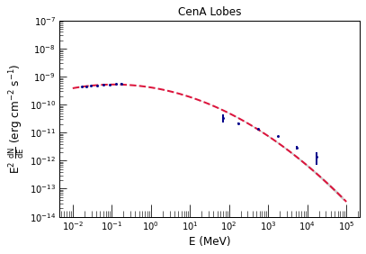
| 7 | M | (263.3 deg, -3.106 deg) | Vela X | PWN | 0.9 | 2.18 | 13 | Vela Pulsar | Pulsar | 0.4 | 1.97 | 18 | Vela Pulsar; SWIFT J0837.8-4440;  | Pulsar; U2;  |  | 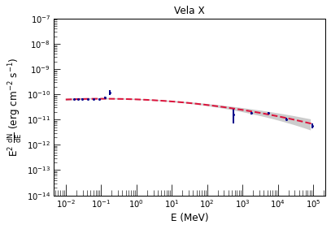
| 8 | M | (313.6 deg, 0.2404 deg) | HESS J1420-607 | PWN | 0.1 | 2.0 | 3.7 | Rabbit | Pulsar | 0.2 | 1.53 | 0.8 | ... | ... |  | 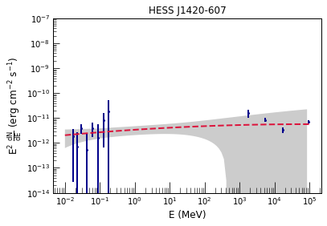
| 9 | M | (320.3 deg, -1.209 deg) | MSH 15-52 | PWN | 0.2 | 1.83 | 5.3 | PSR B1509-58 | Pulsar | 0.0 | 1.85 | 26 | ... | ... |  | 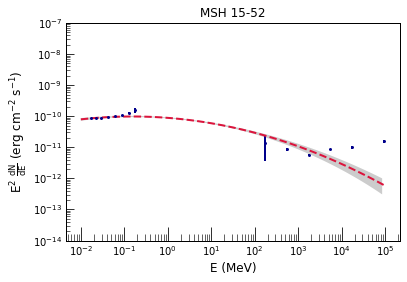
| 10 | M | (332.4 deg, -0.1309 deg) | HESS J1616-508 | PWN | 0.3 | 2.05 | 12 | PSR J1617-5055 | Pulsar | 0.2 | 2.05 | 1.5 | ... | ... |  | 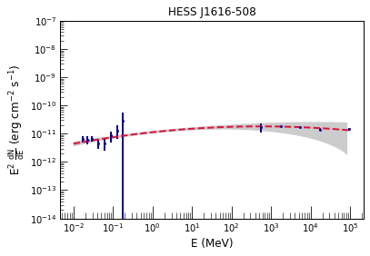
| 11 | M | (17.57 deg, -0.4532 deg) | HESS J1825-137 | PWN | 0.8 | 1.75 | 14 | IGR J18246-1425 | Pulsar | 0.6 | 2.8 | 1.9 | IGR J18246-1425; XMMSL1 J182155.0-134719;  | Pulsar; HMXB;  |  | 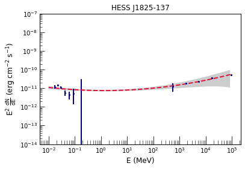
| 12 | M | (26.8 deg, -0.1983 deg) | HESS J1841-055 | PWN | 0.6 | 1.98 | 13 | AX J1841.0-0535 | HMXB | 0.1 | 1.91 | 2.5 | AX J1841.0-0535; 1E 1841-045;  | HMXB; Pulsar;  |  | 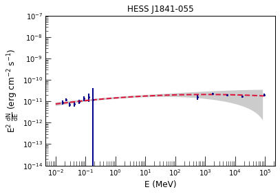
| 13 | M | (336.2 deg, 0.166 deg) | FGES J1631.6-4756 | pwn | 0.3 | 1.76 | 3 | AX J1631.9-4752 | Pulsar | 0.1 | 2.84 | 31 | ... | ... |  | 
| 14 | M | (25.13 deg, 0.1583 deg) | FGES J1836.5-0651 | pwn | 0.5 | 2.04 | 22 | PSR J1838-0655 | Pulsar | 0.3 | 1.71 | 6.9 | ... | ... |  | 
| 15 | M | (25.23 deg, -0.4648 deg) | FGES J1838.9-0704 | pwn | 0.5 | 1.85 | 7 | PSR J1838-0655 | Pulsar | 0.3 | 1.71 | 6.9 | ... | ... |  | 
| 16 | F | (150.2 deg, 4.578 deg) | G150.3+4.5 | SNR | 1.5 | 1.68 | 4.1 | XTE J0421+560 | HMXB | 1.2 | 2.27 | 1.2 | ... | ... |  | 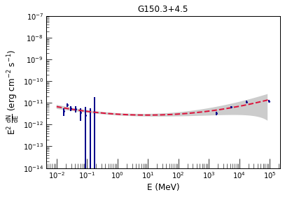
| 17 | U | (180.2 deg, -1.5 deg) | S 147 | SNR | 1.5 | 2.18 | 5.7 | SWIFT J053457.91+282837.9 | U2 | 1.3 | 2.35 | 1.2 | ... | ... |  | 
| 18 | F | (205.4 deg, 0.5035 deg) | Monoceros | SNR | 3.5 | 2.3 | 9.1 | 2MASX J06262702+0727287 | Unknown AGN | 3.2 | 1.87 | 1.6 | ... | ... |  | 
| 19 | M | (266.3 deg, -1.232 deg) | Vela Junior | SNR | 1.0 | 1.79 | 12 | PSR J0855-4644 | Pulsar | 0.8 | 2.06 | 1 | ... | ... |  | 
| 20 | A | (337.1 deg, -0.1229 deg) | G337.0-0.1 | SNR | 0.1 | 2.34 | 10 | SGR 1627-41 | Gamma-ray source | 0.1 | 1.81 | 1.4 | SGR 1627-41; IGR J16358-4726;  | Gamma-ray source; Pulsar;  |  | 
| 21 | F | (78.24 deg, 2.197 deg) | gamma Cygni | SNR | 0.6 | 1.96 | 10 | 2MASX J20183871+4041003 | Sy2 | 0.5 | 2.03 | 2.6 | ... | ... |  | 
| 22 | M | (347.3 deg, -0.4727 deg) | RX J1713.7-3946 | SNR | 0.6 | 1.71 | 7 | SWIFT J1712.9-4002 | U1 | 0.3 | 3.25 | 1.3 | SNR G347.3-0.5; SWIFT J1712.9-4002;  | SNR; U1;  |  | 
| 23 | F | (79.6 deg, 1.396 deg) | Cygnus Cocoon | SFR | 3.0 | 2.09 | 1.2e+02 | Cyg X-3 | HMXB | 0.7 | 3.0 | 2.5e+02 | 2MASX J20183871+4041003; Cyg X-3; SSTSL2 J203705.58+415005.3;  | Sy2; HMXB; Beamed AGN;  |  | 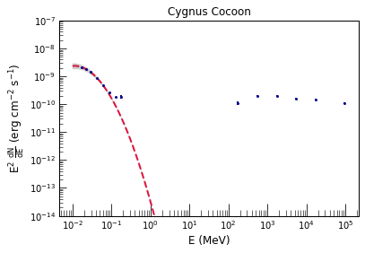
| 24 | M | (336.5 deg, 0.1166 deg) | FGES J1633.0-4746 | spp | 0.6 | 2.17 | 25 | AX J1631.9-4752 | Pulsar | 0.2 | 2.84 | 31 | AX J1631.9-4752; 4U 1630-47; IGR J16328-4726; SGR 1627-41; IGR J16358-4726;  | Pulsar; LMXB; HMXB; Gamma-ray source; Pulsar;  |  | 
| 25 | A | (11.05 deg, -0.1178 deg) | HESS J1809-193 | spp | 0.5 | 2.36 | 5.1 | PSR J1811-1925 | Pulsar | 0.3 | 2.07 | 3.5 | XTE J1810-189; PSR J1811-1925;  | LMXB; Pulsar;  |  | 
| 26 | M | (12.95 deg, 0.1711 deg) | HESS J1813-178 | spp | 0.6 | 2.34 | 15 | IGR J18135-1751 | SNR | 0.2 | 1.92 | 4.1 | IGR J18135-1751; GX 13+1;  | SNR; LMXB;  |  | 
| 27 | F | (23.2 deg, -0.28 deg) | W 41 | spp | 0.2 | 2.13 | 11 | Swift J1834.9-0846 | star | 0.2 | 2.13 | 0.96 | ... | ... |  | 
| 28 | M | (27.37 deg, 0.1215 deg) | Kes 73 | spp | 0.3 | 2.37 | 7.2 | 1E 1841-045 | Pulsar | 0.1 | 1.33 | 11 | ... | ... |  | 
| 29 | U | (286.1 deg, -0.1815 deg) | FGES J1036.3-5833 | ... | 2.5 | 1.93 | 29 | Eta Carina | XRB | 1.6 | 3.76 | 0.78 | 4U 1036-56; Eta Carina; 2MASS J10445192-6025115;  | HMXB; XRB; star;  |  | 
| 30 | U | (312.1 deg, 0.1257 deg) | FGES J1409.1-6121 | ... | 0.7 | 2.16 | 25 | SWIFT J1408.2-6113 | CV | 0.2 | 2.68 | 1.1 | [CG2001] G311.45-0.13; SWIFT J1408.2-6113; MAXI J1409-619;  | U2; CV; Pulsar;  |  | 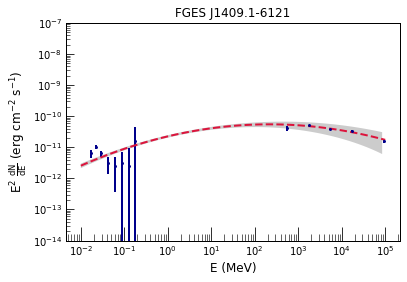
| 31 | U | (9.884 deg, -0.1821 deg) | HESS J1808-204 | ... | 0.6 | 2.57 | 4.9 | SGR 1806-20 | Pulsar | 0.1 | 1.66 | 5.3 | ... | ... |  | 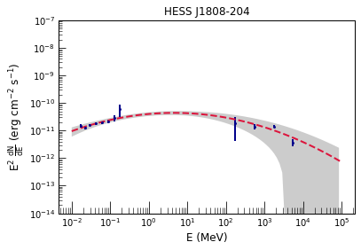
