## Point source

- 156 point-like sources, cross-matched between Swift-BAT and Fermi-LAT catalogs.
- BPL fitting (crossmatch_latest_SherpaBPLfit.csv), using Sherpa.
- Index1 is free.

| id| bat_name_counterpart| bat_category_type| fermi_name_counterpart| fermi_category_type| separation| Flag| match_with_1FLE| bat_coord| bat_pindex| fermi_pindex_PL| bat_flux| fermi_flux| fermi_var_index| BPL_Eb| BPL_index1| BPL_index2| BPL_K| SED&nbsp;&nbsp;&nbsp;&nbsp;;&nbsp;&nbsp;&nbsp;option&nbsp;&nbsp;&nbsp;&nbsp;;&nbsp;&nbsp;&nbsp;option&nbsp;&nbsp;&nbsp;&nbsp; | SED&nbsp;&nbsp;&nbsp;&nbsp;;&nbsp;&nbsp;&nbsp;option&nbsp;&nbsp;&nbsp;&nbsp;;&nbsp;&nbsp;&nbsp;option&nbsp;&nbsp;&nbsp;&nbsp;
|--- |--- |--- |--- |--- |--- |--- |--- |--- |--- |--- |--- |--- |--- |--- |--- |--- |--- |--- |---
| 156 | XTE J1817-330 | LMXB | (SWIFT J1817.8-3301) | unk | 0.144 | U | 0 | (274.3, -32.98) | 1.65 | 2.5 | 1.78e-11 | 2.25e-12 | 8.8 | 1.31e+06 | 1.648597158981421 | 2.5553499635462957 | 1.82e-11 |  | 
| 1 | [HB89] 0537-441 | Beamed AGN | PKS 0537-441 | BLL | 0.063 | M | 1 | (84.63, -44.12) | 0.88 | 2.11 | 1.49e-11 | 1.66e-10 | 9.8e+03 | 7.92e+05 | 0.8664745724764331 | 2.1525070387094503 | 1.12e-10 |  | 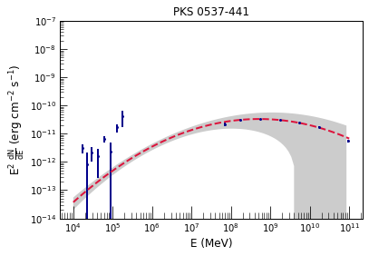 
| 2 | [HB89] 0716+714 | Beamed AGN | S5 0716+71 | BLL | 0.01 | M | 1 | (110.5, 71.33) | 1.15 | 2.08 | 1.90e-11 | 2.15e-10 | 2.7e+03 | 1.08e+06 | 1.152251018728624 | 2.1060334207270794 | 7.07e-11 |  | 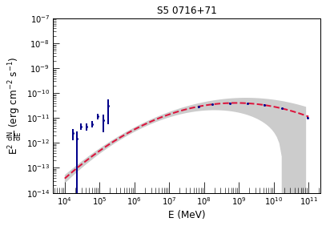
| 3 | Mrk 421 | Beamed AGN | Mkn 421 | BLL | 0.014 | M | 1 | (166.1, 38.21) | 2.76 | 1.78 | 1.41e-10 | 4.23e-10 | 1.3e+03 | 4.98e+05 | 2.7537278459544194 | 1.7816921534649632 | 5.04e-12 |  | 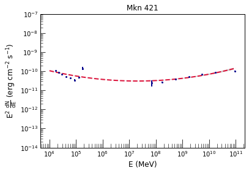
| 4 | Mrk 501 | Beamed AGN | Mkn 501 | BLL | 0.001 | M | 0 | (253.5, 39.76) | 2.39 | 1.76 | 7.16e-11 | 1.29e-10 | 5.4e+02 | 6.35e+06 | 2.3905802120929445 | 1.7651847532586633 | 8.31e-12 |  | 
| 5 | BL Lac | Beamed AGN | BL Lac | BLL | 0.018 | M | 1 | (330.7, 42.27) | 1.76 | 2.2 | 3.49e-11 | 2.30e-10 | 3.5e+03 | 3.78e+08 | 1.8256173137356917 | 2.2885919082417567 | 2.11e-11 |  | 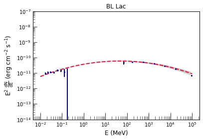
| 6 | 1ES 0033+595 | Beamed AGN | 1ES 0033+595 | bll | 0.008 | M | 0 | (8.989, 59.84) | 2.81 | 1.76 | 2.60e-11 | 3.99e-11 | 2e+02 | 9.68e+05 | 2.8123972030440707 | 1.7629791433870508 | 7.62e-13 |  | 
| 7 | 2MASX J01155048+2515369 | Sy1 | RX J0115.7+2519 | bll | 0.018 | A | 0 | (18.97, 25.33) | 1.97 | 1.92 | 1.09e-11 | 1.98e-11 | 3.1e+02 | 9.34e+08 | 2.0540785674692987 | 1.8693760151174328 | 3.40e-12 |  | 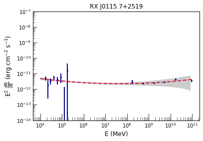
| 8 | SHBL J012308.7+342049 | Beamed AGN | 1ES 0120+340 | bll | 0.021 | M | 0 | (20.78, 34.37) | 2.94 | 1.7 | 1.13e-11 | 3.04e-12 | 15 | 8.87e+06 | 2.925880755803125 | 1.5891059413345812 | 2.26e-13 |  | 
| 9 | B3 0133+388 | Beamed AGN | B3 0133+388 | bll | 0.052 | M | 0 | (24.13, 39.05) | 1.99 | 1.72 | 7.91e-12 | 5.06e-11 | 61 | 1.28e+08 | 2.002681286084388 | 1.7608397615338216 | 2.96e-12 |  | 
| 10 | RBS 259 | Beamed AGN | 1RXS J015658.6-530208 | bll | 0.062 | M | 0 | (29.13, -53.04) | 2.31 | 1.74 | 7.32e-12 | 5.87e-12 | 45 | 1.31e+08 | 2.2793118042604994 | 1.727294068976566 | 1.22e-12 |  | 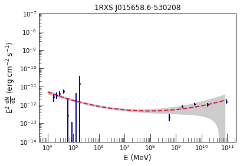
| 11 | 2MASX J02141794+5144520 | Beamed AGN | TXS 0210+515 | bll | 0.03 | M | 0 | (33.55, 51.77) | 2.58 | 1.9 | 1.36e-11 | 5.28e-12 | 13 | 4.40e+06 | 2.567575384904398 | 1.907373466140304 | 9.03e-13 |  | 
| 12 | QSO B0229+200 | Beamed AGN | 1ES 0229+200 | bll | 0.036 | M | 0 | (38.19, 20.29) | 2.28 | 1.79 | 2.35e-11 | 3.68e-12 | 6.8 | 7.56e+08 | 2.343256150068444 | 1.708496119576655 | 3.04e-12 |  | 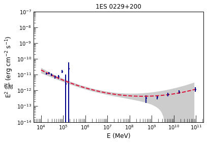
| 13 | ESO 416-G002 | Sy1.9 | PHL 1389 | bll | 0.068 | A | 0 | (38.83, -29.63) | 1.67 | 2.03 | 2.12e-11 | 1.65e-12 | 14 | 6.96e+00 | 1.9166704833972763 | 2.2966018432405284 | 2.00e-10 |  | 
| 14 | BZB J0244-5819 | Beamed AGN | RBS 0351 | bll | 0.031 | M | 0 | (41.19, -58.3) | 2.43 | 1.75 | 1.01e-11 | 6.70e-12 | 40 | 2.98e+07 | 2.426064302179662 | 1.7324261642622782 | 1.05e-12 |  | 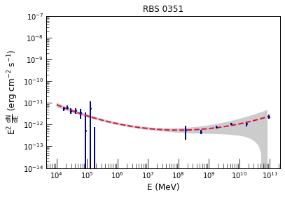
| 15 | QSO B0347-121 | Beamed AGN | 1ES 0347-121 | bll | 0.018 | M | 0 | (57.37, -11.98) | 2.2 | 1.76 | 1.57e-11 | 3.89e-12 | 13 | 1.02e+09 | 2.302486575643662 | 1.6658531253046602 | 2.26e-12 |  | 
| 16 | PKS 0352-686 | Beamed AGN | PKS 0352-686 | bll | 0.004 | M | 0 | (58.28, -68.53) | 2.52 | 1.67 | 1.22e-11 | 3.27e-12 | 8.3 | 1.12e+08 | 2.5184972196893147 | 1.5635826589560602 | 9.47e-13 |  | 
| 17 | PKS 0426-380 | Beamed AGN | PKS 0426-380 | bll | 0.059 | M | 0 | (67.14, -37.89) | 2.56 | 2.1 | 3.82e-12 | 2.13e-10 | 3.5e+03 | 1.16e+04 | 2.3938992388904694 | 2.0086834430370044 | 5.83e-12 |  | 
| 18 | PKS 0548-322 | Beamed AGN | PKS 0548-322 | bll | 0.054 | M | 0 | (87.69, -32.27) | 3.23 | 1.89 | 1.82e-11 | 3.89e-12 | 9 | 7.09e+05 | 3.235800981459212 | 1.8803894064835136 | 1.24e-13 |  | 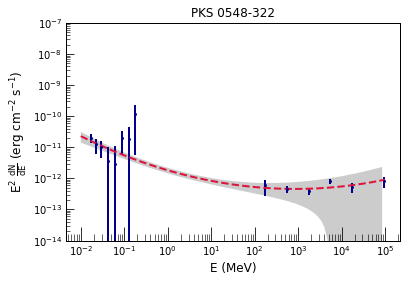
| 19 | PMN J0640-1253 | Beamed AGN | TXS 0637-128 | bll | 0.056 | M | 0 | (100.1, -12.87) | 2.56 | 1.65 | 7.87e-12 | 5.59e-12 | 4.9 | 2.66e+07 | 2.554063981051119 | 1.5906905389310295 | 5.42e-13 |  | 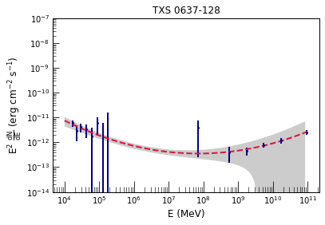
| 20 | 2MASX J07103005+5908202 | Beamed AGN | 1H 0658+595 | bll | 0.008 | M | 0 | (107.6, 59.14) | 2.28 | 1.69 | 2.41e-11 | 6.69e-12 | 27 | 5.48e+08 | 2.323407638774245 | 1.662197971689519 | 3.36e-12 |  | 
| 21 | 2MASS J09303759+4950256 | Beamed AGN | 1ES 0927+500 | bll | 0.069 | M | 0 | (142.5, 49.88) | 2.59 | 1.82 | 7.44e-12 | 2.30e-12 | 16 | 2.48e+07 | 2.5778768515757005 | 1.7323804382777817 | 4.77e-13 |  | 
| 22 | 2MASS J09343014-1721215 | Beamed AGN | RXC J0934.4-1721 | bll | 0.039 | M | 0 | (143.6, -17.34) | 2.73 | 1.94 | 7.93e-12 | 2.09e-12 | 8 | 8.75e+04 | 2.718755767625658 | 2.1534303701275244 | 3.20e-13 |  | 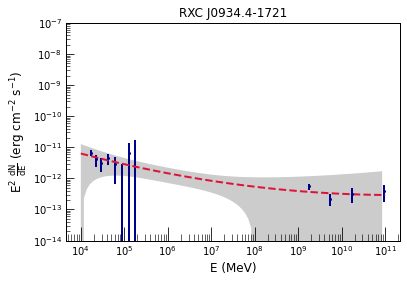
| 23 | 2MASX J10311847+5053358 | Beamed AGN | 1ES 1028+511 | bll | 0.02 | M | 0 | (157.9, 50.9) | 2.85 | 1.74 | 7.85e-12 | 1.20e-11 | 13 | 1.40e+06 | 2.8564768341070392 | 1.6957149799840188 | 1.98e-13 |  | 
| 24 | 2MASX J11033765-2329307 | Beamed AGN | 1ES 1101-232 | bll | 0.045 | M | 0 | (165.9, -23.47) | 2.53 | 1.77 | 1.08e-11 | 5.46e-12 | 13 | 2.10e+07 | 2.526941790247953 | 1.7121323956890535 | 8.12e-13 |  | 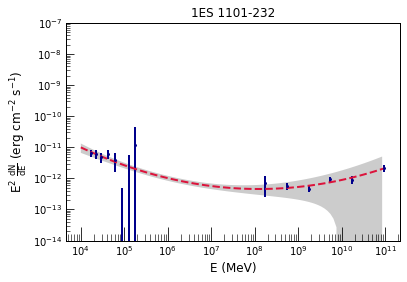
| 25 | 2MASX J11363009+6737042 | Beamed AGN | RX J1136.5+6737 | bll | 0.033 | M | 0 | (174.1, 67.64) | 2.33 | 1.75 | 1.27e-11 | 6.29e-12 | 28 | 1.27e+08 | 2.322670944462108 | 1.7697739212818853 | 1.83e-12 |  | 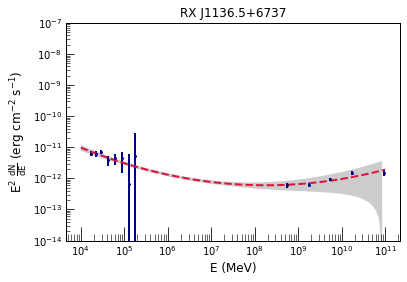
| 26 | FBQS J1221+3010 | Beamed AGN | PG 1218+304 | bll | 0.008 | M | 0 | (185.3, 30.16) | 2.94 | 1.71 | 1.06e-11 | 4.37e-11 | 60 | 5.91e+05 | 2.9390040535360713 | 1.6749276862293867 | 2.02e-13 |  | 
| 27 | [HB89] 1415+259 | Beamed AGN | 1E 1415.6+2557 | bll | 0.041 | M | 0 | (214.4, 25.72) | 2.61 | 1.45 | 5.93e-12 | 3.34e-12 | 8.1 | 6.10e+07 | 2.6133791842839207 | 1.3963571112991802 | 3.36e-13 |  | 
| 28 | 1ES 1426+428 | Beamed AGN | H 1426+428 | bll | 0.027 | M | 0 | (217.1, 42.66) | 2.56 | 1.63 | 2.09e-11 | 8.81e-12 | 16 | 4.66e+07 | 2.5523165189761805 | 1.5899963248409366 | 1.44e-12 |  | 
| 29 | [HB89] 1803+784 | Beamed AGN | S5 1803+784 | bll | 0.057 | M | 1 | (269.9, 78.47) | 1.93 | 2.21 | 9.08e-12 | 5.42e-11 | 2.8e+02 | 1.35e+08 | 1.8133273491166533 | 2.250477809673008 | 6.31e-12 |  | 
| 30 | QSO B1959+650 | Beamed AGN | 1ES 1959+650 | bll | 0.019 | M | 0 | (300, 65.16) | 2.67 | 1.82 | 2.90e-11 | 1.10e-10 | 1.5e+03 | 3.43e+05 | 2.664353338003141 | 1.8158460159328835 | 1.39e-12 |  | 
| 31 | 2MASX J23470479+5142179 | Beamed AGN | 1ES 2344+514 | bll | 0.005 | M | 0 | (356.8, 51.69) | 2.66 | 1.81 | 1.00e-11 | 3.20e-11 | 60 | 3.73e+05 | 2.6651649583456227 | 1.8268519341098792 | 4.78e-13 |  | 
| 32 | H 2356-309 | Beamed AGN | H 2356-309 | bll | 0.058 | M | 0 | (359.8, -30.58) | 2.28 | 1.82 | 1.49e-11 | 5.34e-12 | 12 | 5.24e+08 | 2.264382168213228 | 1.7812126946754738 | 2.57e-12 |  | 
| 33 | 3C 454.3 | Beamed AGN | 3C 454.3 | FSRQ | 0.011 | M | 1 | (343.5, 16.15) | 1.5 | 2.4 | 1.58e-10 | 9.95e-10 | 5.6e+04 | 2.76e+07 | 1.5038420920154392 | 2.5555825688062597 | 2.39e-10 |  | 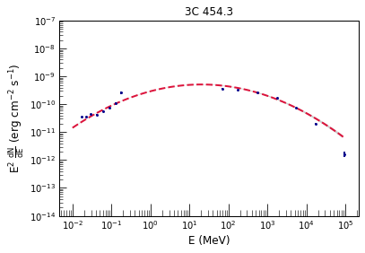
| 34 | [HB89] 2230+114 | Beamed AGN | CTA 102 | FSRQ | 0.031 | M | 1 | (338.2, 11.71) | 1.49 | 2.29 | 3.01e-11 | 4.90e-10 | 7.5e+04 | 4.25e+07 | 1.4972328930743544 | 2.405087272750505 | 4.62e-11 |  | 
| 35 | PKS 2227-088 | Beamed AGN | PKS 2227-08 | FSRQ | 0.072 | M | 1 | (337.5, -8.492) | 1.46 | 2.59 | 1.71e-11 | 4.22e-11 | 6.4e+02 | 1.34e+07 | 1.4750359337678935 | 2.6492914855426766 | 2.76e-11 |  | 
| 36 | [HB89] 2142-758 | Beamed AGN | PKS 2142-75 | FSRQ | 0.074 | M | 1 | (327.1, -75.58) | 1.41 | 2.44 | 1.46e-11 | 5.64e-11 | 2.8e+03 | 9.06e+06 | 1.4162037682311308 | 2.4947013611743034 | 2.76e-11 |  | 
| 37 | QSO B2013+370 | Beamed AGN | MG2 J201534+3710 | FSRQ | 0.036 | M | 0 | (303.9, 37.21) | 2.13 | 2.45 | 1.82e-11 | 7.53e-11 | 1.3e+02 | 1.68e+09 | 1.9298494738423069 | 2.7812958008840374 | 9.42e-12 |  | 
| 38 | PKS 1830-21 | Beamed AGN | PKS 1830-211 | FSRQ | 0.017 | M | 1 | (278.4, -21.07) | 1.47 | 2.53 | 8.73e-11 | 1.92e-10 | 2.5e+03 | 1.32e+07 | 1.4756961897280054 | 2.6689551017544946 | 1.42e-10 |  | 
| 39 | 3C 345 | Beamed AGN | 3C 345 | FSRQ | 0.026 | M | 0 | (250.8, 39.81) | 1.17 | 2.4 | 2.07e-11 | 3.02e-11 | 2e+02 | 1.30e+06 | 1.167101118478204 | 2.4322138343092834 | 7.46e-11 |  | 
| 40 | PKS 1622-29 | Beamed AGN | PKS B1622-297 | FSRQ | 0.034 | M | 1 | (246.6, -29.86) | 1.32 | 2.56 | 1.55e-11 | 3.91e-11 | 4.3e+02 | 6.58e+06 | 1.3350948088678478 | 2.5902177068064542 | 3.62e-11 |  | 
| 41 | PKS 1510-08 | Beamed AGN | PKS 1510-089 | FSRQ | 0.025 | M | 1 | (228.2, -9.081) | 1.32 | 2.38 | 6.68e-11 | 4.18e-10 | 5.9e+03 | 7.84e+06 | 1.3240557793314771 | 2.4415153120388124 | 1.61e-10 |  | 
| 42 | 3C 279 | Beamed AGN | 3C 279 | FSRQ | 0.015 | M | 1 | (194.1, -5.799) | 1.32 | 2.29 | 3.88e-11 | 4.50e-10 | 3e+04 | 8.90e+06 | 1.3170530217945566 | 2.3508512847606737 | 9.57e-11 |  | 
| 43 | 3C 273 | Beamed AGN | 3C 273 | FSRQ | 0.009 | M | 1 | (187.3, 2.047) | 1.75 | 2.7 | 4.22e-10 | 1.14e-10 | 7e+03 | 9.76e+06 | 1.7511063403682805 | 2.774782179734267 | 3.26e-10 |  | 
| 44 | PG 1222+216 | Beamed AGN | 4C +21.35 | FSRQ | 0.021 | M | 1 | (186.2, 21.4) | 1.7 | 2.34 | 2.45e-11 | 1.97e-10 | 2e+04 | 1.14e+08 | 1.7145497691669247 | 2.3773675420919838 | 2.08e-11 |  | 
| 45 | 4C +49.22 | Beamed AGN | 4C +49.22 | FSRQ | 0.017 | M | 1 | (178.3, 49.5) | 1.83 | 2.41 | 1.28e-11 | 1.58e-11 | 1.2e+03 | 2.80e+07 | 1.8328186646438134 | 2.4694777358094444 | 7.86e-12 |  | 
| 46 | [HB89] 0836+710 | Beamed AGN | 4C +71.07 | FSRQ | 0.004 | M | 1 | (130.3, 70.89) | 1.7 | 2.82 | 6.98e-11 | 4.77e-11 | 3.4e+03 | 3.11e+07 | 1.7032043642798331 | 2.992005875776205 | 6.15e-11 |  | 
| 47 | PMN J0641-0320 | Beamed AGN | PMN J0641-0320 | FSRQ | 0.046 | M | 0 | (100.5, -3.362) | 0.96 | 2.68 | 2.19e-11 | 2.46e-11 | 3.6e+02 | 1.61e+06 | 0.9445692774165482 | 2.640840224656191 | 1.36e-10 |  | 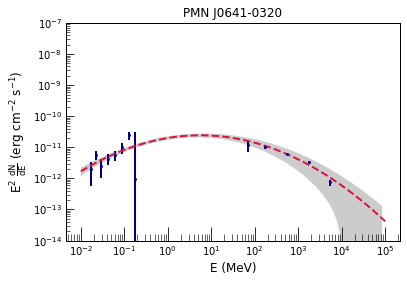
| 48 | PKS 0528+134 | Beamed AGN | PKS 0528+134 | FSRQ | 0.032 | M | 0 | (82.74, 13.57) | 1.25 | 2.56 | 1.82e-11 | 2.18e-11 | 4.6e+02 | 5.14e+06 | 1.2555685041208329 | 2.721400421904003 | 5.22e-11 |  | 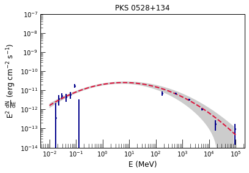
| 49 | PKS 0402-362 | Beamed AGN | PKS 0402-362 | FSRQ | 0.017 | M | 1 | (60.97, -36.07) | 1.91 | 2.53 | 1.07e-11 | 7.44e-11 | 6.1e+03 | 1.52e+08 | 1.7235372580064765 | 2.662748652891736 | 9.92e-12 |  | 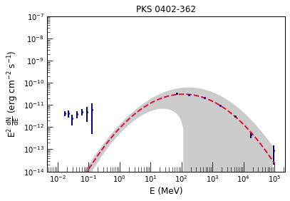
| 50 | PKS 2325+093 | Beamed AGN | PKS 2325+093 | fsrq | 0.012 | M | 1 | (351.9, 9.663) | 1.4 | 2.69 | 2.97e-11 | 1.79e-11 | 3.7e+02 | 4.20e+06 | 1.4023431316188846 | 2.7146203088542 | 5.86e-11 |  | 
| 51 | 87GB 215950.2+503417 | Beamed AGN | NRAO 676 | fsrq | 0.016 | M | 1 | (330.4, 50.82) | 1.78 | 2.66 | 1.90e-11 | 5.11e-11 | 3.1e+03 | 1.41e+08 | 1.8096331558615892 | 2.7174526095909823 | 1.22e-11 |  | 
| 52 | PKS 2149-306 | Beamed AGN | PKS 2149-306 | fsrq | 0.015 | M | 1 | (328, -30.46) | 1.61 | 2.85 | 8.93e-11 | 3.01e-11 | 9.6e+02 | 1.03e+07 | 1.6086595984110994 | 2.9498305556551063 | 1.02e-10 |  | 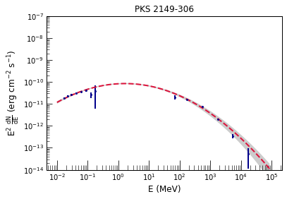
| 53 | [HB89] 1921-293 | Beamed AGN | PKS B1921-293 | fsrq | 0.063 | M | 0 | (291.2, -29.18) | 2.04 | 2.39 | 1.62e-11 | 2.27e-11 | 2.8e+02 | 3.27e+08 | 1.9959454796328235 | 2.444832501529304 | 6.37e-12 |  | 
| 54 | 2MASS J16561677-3302127 | Beamed AGN | 2MASS J16561677-3302127 | fsrq | 0.024 | M | 0 | (254.1, -33.04) | 1.55 | 2.79 | 6.16e-11 | 1.53e-11 | 1.3e+02 | 6.80e+06 | 1.5480135393939385 | 2.9115703113456086 | 8.27e-11 |  | 
| 55 | [HB89] 1354+195 | Beamed AGN | 4C +19.44 | fsrq | 0.079 | M | 0 | (209.3, 19.29) | 2.02 | 2.76 | 8.67e-12 | 3.99e-12 | 39 | 7.07e+07 | 1.9816615082756204 | 2.736311621147991 | 3.56e-12 |  | 
| 56 | [HB89] 1334-127 | Beamed AGN | PKS 1335-127 | fsrq | 0.013 | M | 0 | (204.4, -12.95) | 2.19 | 2.42 | 1.32e-11 | 1.81e-11 | 95 | 1.03e+09 | 2.0107913429446285 | 2.781499055485356 | 5.37e-12 |  | 
| 57 | PKS 1329-049 | Beamed AGN | PKS 1329-049 | fsrq | 0.032 | M | 1 | (203, -5.153) | 1.51 | 2.51 | 1.55e-11 | 3.48e-11 | 2.2e+03 | 1.35e+07 | 1.5135154407773124 | 2.6006058564751067 | 2.29e-11 |  | 
| 58 | SWIFT J1254.9+1165 | U3 | ON 187 | fsrq | 0.006 | U | 0 | (193.7, 11.65) | 1.72 | 2.79 | 1.32e-11 | 5.16e-12 | 28 | 1.36e+07 | 1.7251384857646408 | 2.8163280861163558 | 1.10e-11 |  | 
| 59 | 4C +04.42 | Beamed AGN | 4C +04.42 | fsrq | 0.047 | M | 0 | (185.6, 4.219) | 1.45 | 2.79 | 3.62e-11 | 1.94e-11 | 1.6e+02 | 6.84e+06 | 1.4559430910592424 | 2.8387826425910716 | 6.20e-11 |  | 
| 60 | FBQS J1159+2914 | Beamed AGN | Ton 599 | fsrq | 0.045 | M | 1 | (179.9, 29.23) | 1.84 | 2.19 | 7.49e-12 | 1.19e-10 | 7.7e+03 | 3.30e+08 | 1.7281466636745717 | 2.3010309849838584 | 6.66e-12 |  | 
| 61 | 7C 1150+3324 | Beamed AGN | B2 1150+33A | fsrq | 0.053 | M | 0 | (178.2, 33.09) | 1.83 | 3.01 | 1.01e-11 | 2.78e-12 | 19 | 3.22e+07 | 1.8292959839786989 | 3.141550039787837 | 6.27e-12 |  | 
| 62 | PKS 1143-696 | Beamed AGN | PKS 1143-696 | fsrq | 0.077 | M | 0 | (176.5, -69.9) | 1.69 | 2.69 | 1.54e-11 | 5.60e-12 | 35 | 1.24e+07 | 1.6927779857094707 | 2.7955679334330767 | 1.40e-11 |  | 
| 63 | PKS 1127-14 | Beamed AGN | PKS 1127-14 | fsrq | 0.065 | M | 0 | (172.5, -14.8) | 1.88 | 2.69 | 2.87e-11 | 8.90e-12 | 4.1e+02 | 2.65e+07 | 1.8857751660505808 | 2.7732429905049085 | 1.52e-11 |  | 
| 64 | [HB89] 1039+811 | Beamed AGN | S5 1039+81 | fsrq | 0.022 | M | 0 | (161.2, 80.92) | 1.67 | 2.78 | 1.17e-11 | 9.22e-12 | 47 | 3.74e+07 | 1.6685226207479875 | 3.02408910464741 | 1.14e-11 |  | 
| 65 | SWIFT J0949.1+4057 | confused source | 4C +40.24 | fsrq | 0.063 | U | 0 | (147.3, 40.57) | 2.46 | 2.61 | 7.26e-12 | 3.15e-12 | 32 | 3.59e+08 | 2.1235702630450746 | 2.761953870264512 | 2.28e-12 |  | 
| 66 | CGRaBS J0805+6144 | Beamed AGN | TXS 0800+618 | fsrq | 0.048 | M | 0 | (121.3, 61.75) | 1.35 | 2.8 | 1.75e-11 | 6.70e-12 | 2.2e+02 | 3.62e+06 | 1.3527217344779834 | 2.8206109295827284 | 3.93e-11 |  | 
| 67 | B2 0743+25 | Beamed AGN | B2 0743+25 | fsrq | 0.042 | M | 0 | (116.6, 25.81) | 1.43 | 2.86 | 3.60e-11 | 6.69e-12 | 88 | 5.18e+06 | 1.4367364669188656 | 3.0261609563516467 | 6.47e-11 |  | 
| 68 | PKS 0637-752 | Beamed AGN | PKS 0637-75 | fsrq | 0.038 | M | 0 | (99.02, -75.28) | 2.0 | 2.7 | 1.65e-11 | 1.25e-11 | 4.5e+02 | 8.85e+07 | 1.9508687368812765 | 2.6840036372557123 | 7.45e-12 |  | 
| 69 | [HB89] 0552+398 | Beamed AGN | B2 0552+39A | fsrq | 0.02 | M | 0 | (88.9, 39.81) | 1.54 | 2.76 | 2.14e-11 | 1.76e-11 | 1.5e+02 | 1.04e+07 | 1.5415814773593752 | 2.77780377425654 | 2.93e-11 |  | 
| 70 | [HB89] 0537-286 | Beamed AGN | PKS 0537-286 | fsrq | 0.045 | M | 0 | (84.97, -28.7) | 1.33 | 2.73 | 2.90e-11 | 1.60e-11 | 1.1e+02 | 4.04e+06 | 1.337742851812096 | 2.7932885239463103 | 6.75e-11 |  | 
| 71 | PKS 0524-460 | Beamed AGN | PKS 0524-460 | fsrq | 0.035 | M | 0 | (81.32, -46.01) | 1.37 | 2.38 | 1.55e-11 | 3.47e-12 | 7.3 | 8.75e+04 | 1.3688920478240871 | 2.2829567879762376 | 3.42e-11 |  | 
| 72 | [HB89] 0403-132 | Beamed AGN | PKS 0403-13 | fsrq | 0.061 | M | 0 | (61.36, -13.14) | 1.78 | 2.55 | 1.10e-11 | 8.71e-12 | 80 | 1.42e+07 | 1.7836422419336857 | 2.5372047030538134 | 7.77e-12 |  | 
| 73 | 4C +50.11 | Beamed AGN | NRAO 150 | fsrq | 0.017 | M | 0 | (59.9, 50.97) | 1.51 | 2.66 | 1.72e-11 | 3.28e-11 | 7.7e+02 | 1.30e+07 | 1.508651169087201 | 2.6667480575758855 | 2.57e-11 |  | 
| 74 | [HB89] 0212+735 | Beamed AGN | S5 0212+73 | fsrq | 0.073 | M | 1 | (34.38, 73.81) | 1.55 | 2.94 | 3.50e-11 | 1.36e-11 | 41 | 1.03e+07 | 1.5495006860887526 | 2.97748911910428 | 4.68e-11 |  | 
| 75 | PMN J0145-2733 | Unknown AGN | PKS 0142-278 | fsrq | 0.042 | U | 1 | (26.21, -27.54) | 1.43 | 2.6 | 1.07e-11 | 9.83e-12 | 8.1e+02 | 5.51e+06 | 1.4269970325109145 | 2.698174252961727 | 1.97e-11 |  | 
| 76 | ESO 354- G 004 | Sy1.9 | PMN J0151-3605 | bcu | 0.007 | A | 0 | (27.87, -36.13) | 1.98 | 2.28 | 1.12e-11 | 2.22e-12 | 8 | 3.26e+00 | 1.978983890550321 | 2.237710594744392 | 4.76e-11 |  | 
| 77 | 4C +33.06 | Beamed AGN | 4C +33.06 | bcu | 0.049 | M | 0 | (46.19, 33.8) | 1.86 | 2.57 | 1.19e-11 | 2.99e-12 | 33 | 6.10e+07 | 1.845138154757469 | 3.052110636939333 | 7.10e-12 |  | 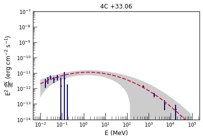
| 78 | PKS 0706-15 | Beamed AGN | PKS 0706-15 | bcu | 0.024 | M | 0 | (107.3, -15.44) | 3.42 | 1.81 | 7.37e-12 | 4.62e-12 | 19 | 3.82e+05 | 3.41740606285785 | 1.7982578700409717 | 2.63e-14 |  | 
| 79 | PKS 0723-008 | Beamed AGN | PKS 0723-008 | bcu | 0.03 | M | 0 | (111.5, -0.942) | 1.75 | 2.06 | 1.48e-11 | 1.08e-11 | 22 | 2.56e+00 | 1.8193596023084808 | 2.092155192671518 | 1.06e-10 |  | 
| 80 | 2MASX J07332681+5153560 | Beamed AGN | NVSS J073326+515355 | bcu | 0.057 | M | 0 | (113.4, 51.93) | 2.32 | 1.81 | 8.17e-12 | 2.78e-12 | 12 | 5.91e+08 | 2.2604816069474003 | 1.809253985206684 | 1.47e-12 |  | 
| 81 | IGR J13109-5552 | Sy1 | PMN J1310-5552 | bcu | 0.03 | D | 0 | (197.7, -55.91) | 1.56 | 2.82 | 2.47e-11 | 7.23e-12 | 78 | 3.88e+06 | 1.5619662102553242 | 2.751699686526397 | 3.21e-11 |  | 
| 82 | PMN J1508-4953 | Beamed AGN | PMN J1508-4953 | bcu | 0.013 | M | 0 | (227.2, -49.87) | 1.15 | 2.84 | 2.86e-11 | 1.86e-11 | 36 | 3.47e+06 | 1.1463914072898342 | 2.8590507602714097 | 1.08e-10 |  | 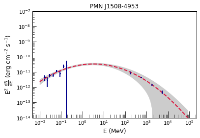
| 83 | SGR A* | Galactic Center | Galactic Centre | bcu | 0.016 | D | 0 | (266.4, -29.01) | 2.69 | 2.34 | 1.13e-10 | 4.21e-10 | 2.6 | 4.25e+04 | 2.387124991177922 | 2.0628288132770454 | 1.59e-11 |  | 
| 84 | PKS 1936-623 | Beamed AGN | PKS 1936-623 | bcu | 0.017 | M | 1 | (295.3, -62.16) | 1.32 | 2.43 | 1.78e-11 | 3.64e-11 | 1.2e+03 | 3.48e+06 | 1.3244010955984191 | 2.4905734506381734 | 4.30e-11 |  | 
| 85 | SWIFT J1943536.21+211822.9 | Beamed AGN | MG2 J194359+2118 | bcu | 0.028 | M | 0 | (296, 21.31) | 2.11 | 1.51 | 2.76e-11 | 7.44e-12 | 15 | 5.48e+09 | 2.1867324201421656 | 1.6662383129561575 | 5.77e-12 |  | 
| 86 | B2 2023+33 | Beamed AGN | B2 2023+33 | bcu | 0.008 | M | 0 | (306.3, 33.68) | 1.49 | 2.63 | 1.33e-11 | 2.93e-11 | 1.2e+02 | 2.00e+07 | 1.4901221074438997 | 2.7368940528983705 | 2.09e-11 |  | 
| 87 | RX J2056.6+4940 | Beamed AGN | RGB J2056+496 | bcu | 0.007 | M | 0 | (314.2, 49.66) | 2.62 | 1.86 | 1.30e-11 | 2.15e-11 | 25 | 8.10e+05 | 2.6075359136634018 | 1.8502700997414157 | 7.55e-13 |  | 
| 88 | RBS 1895 | Beamed AGN | RBS 1895 | bcu | 0.014 | M | 0 | (341.7, -52.12) | 2.51 | 1.71 | 6.97e-12 | 2.01e-12 | 19 | 6.82e+07 | 2.5083366156528233 | 1.6601722256293985 | 5.57e-13 |  | 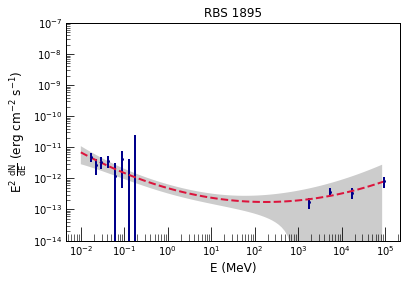
| 89 | 1RXS J225146.9-320614 | Beamed AGN | 1RXS J225146.9-320614 | bcu | 0.044 | M | 0 | (342.9, -32.1) | 2.01 | 1.79 | 1.40e-11 | 1.52e-12 | 11 | 5.48e+08 | 2.348340101884832 | 1.958675344951451 | 1.50e-12 |  | 
| 90 | PKS 0521-36 | Beamed AGN | PKS 0521-36 | AGN | 0.018 | M | 1 | (80.76, -36.46) | 1.92 | 2.46 | 3.51e-11 | 5.51e-11 | 6.8e+02 | 1.42e+08 | 1.9185628206192704 | 2.488941431520501 | 1.69e-11 |  | 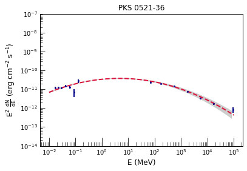
| 91 | Cen A | Beamed AGN | Cen A | RDG | 0.012 | M | 1 | (201.4, -43.02) | 1.88 | 2.64 | 1.35e-09 | 6.26e-11 | 18 | 1.10e+06 | 1.8808832131866644 | 2.638898498479688 | 7.21e-10 |  | 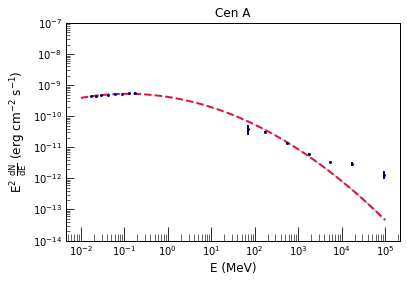
| 92 | 3C 120 | Beamed AGN | 3C 120 | RDG | 0.039 | M | 0 | (68.3, 5.356) | 2.01 | 2.74 | 9.54e-11 | 1.45e-11 | 2.8e+02 | 2.84e+07 | 2.0038724870231395 | 2.802727694514738 | 3.58e-11 |  | 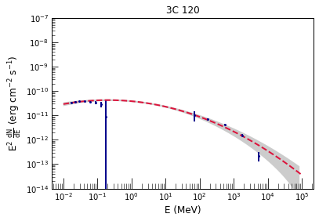
| 93 | NGC 1275 | Beamed AGN | NGC 1275 | RDG | 0.009 | M | 1 | (49.95, 41.51) | 3.82 | 2.11 | 8.26e-11 | 3.32e-10 | 4.8e+03 | 2.94e+04 | 3.674212201592862 | 1.997483646129344 | 1.22e-13 |  | 
| 94 | PKS 2300-18 | Beamed AGN | PKS 2300-18 | rdg | 0.069 | M | 0 | (345.8, -18.7) | 2.03 | 2.18 | 1.46e-11 | 2.45e-12 | 9.9 | 1.70e+04 | 2.129513963810157 | 2.196445298113982 | 2.52e-12 |  | 
| 95 | 3C 303 | Sy1 | 3C 303 | rdg | 0.046 | D | 0 | (220.7, 52.06) | 2.39 | 2.05 | 5.70e-12 | 1.70e-12 | 8.5 | 1.14e+06 | 2.3804524445028283 | 2.1266505041292922 | 6.86e-13 |  | 
| 96 | PICTOR A | Sy2 | Pictor A | rdg | 0.045 | D | 0 | (79.95, -45.77) | 2.05 | 2.43 | 3.73e-11 | 4.12e-12 | 7.3 | 2.32e+06 | 2.0473719849687497 | 2.4657275541443617 | 1.23e-11 |  | 
| 97 | QSO B0309+411 | Beamed AGN | B3 0309+411B | rdg | 0.039 | M | 0 | (48.26, 41.29) | 1.58 | 2.69 | 1.52e-11 | 4.12e-12 | 25 | 4.73e+05 | 1.5816692186795025 | 2.4368806002350096 | 1.86e-11 |  | 
| 98 | NGC 4945 | Sy2 | NGC 4945 | sbg | 0.003 | D | 0 | (196.4, -49.47) | 1.5 | 2.27 | 2.82e-10 | 1.12e-11 | 10 | 3.49e+03 | 1.7683951495679382 | 2.305165093752437 | 5.09e-10 |  | 
| 99 | M 82 | Starburst galaxy | M 82 | sbg | 0.029 | M | 0 | (148.9, 69.64) | 3.39 | 2.22 | 4.83e-12 | 1.06e-11 | 6.1 | 2.04e+04 | 3.3900094177399387 | 2.100425693977368 | 1.97e-14 |  | 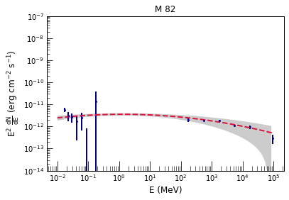
| 100 | NGC 1068 | Sy1.9 | NGC 1068 | sbg | 0.004 | D | 0 | (40.66, -0.004) | 1.82 | 2.33 | 3.79e-11 | 6.53e-12 | 18 | 1.45e+02 | 1.8722743652601064 | 2.2353659826099683 | 1.35e-10 |  | 
| 101 | Circinus Galaxy | Sy2 | Circinus galaxy | sey | 0.01 | M | 0 | (213.3, -65.34) | 2.09 | 2.26 | 2.73e-10 | 6.68e-12 | 14 | 9.31e+03 | 1.9389885589535532 | 2.3550748445914884 | 2.13e-10 |  | 
| 102 | 1H 0323+342 | Beamed AGN | 1H 0323+342 | nlsy1 | 0.046 | M | 0 | (51.21, 34.17) | 1.62 | 2.82 | 2.73e-11 | 1.92e-11 | 2e+02 | 1.63e+07 | 1.6274171098553645 | 2.8637340239760576 | 2.96e-11 |  | 
| 103 | 3C 380 | Beamed AGN | 3C 380 | css | 0.028 | M | 1 | (277.4, 48.74) | 1.52 | 2.42 | 1.52e-11 | 1.79e-11 | 69 | 3.61e+06 | 1.5208958777316548 | 2.4542971881194644 | 2.20e-11 |  | 
| 104 | Cas A | SNR | Cas A | snr | 0.008 | M | 0 | (350.8, 58.82) | 3.33 | 1.97 | 6.49e-11 | 6.17e-11 | 4.5 | 6.60e+04 | 3.357000825197149 | 2.012981641107637 | 2.84e-13 |  | 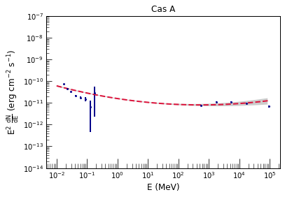
| 105 | Tycho SNR | SNR | Tycho | snr | 0.01 | M | 0 | (6.326, 64.14) | 3.03 | 2.18 | 1.31e-11 | 9.78e-12 | 4.2 | 3.33e+04 | 3.2704497169528306 | 2.13109906970156 | 7.22e-14 |  | 
| 106 | SNR G068.8+02.6 | SNR | PSR J1952+3252 | PSR | 0.016 | D | 0 | (298.3, 32.89) | 2.27 | 2.28 | 9.21e-12 | 1.51e-10 | 6 | 1.38e+09 | 1.7524399961093922 | 2.982844020912866 | 8.43e-12 |  | 
| 107 | SNR G21.5-00.9 | SNR | PSR J1833-1034 | PSR | 0.01 | D | 0 | (278.4, -10.57) | 2.26 | 2.5 | 7.45e-11 | 8.20e-11 | 3 | 2.21e+04 | 2.281395956179817 | 2.1791836776804345 | 1.19e-11 |  | 
| 108 | 4U 1820-30 | LMXB | PSR J1823-3021A | PSR | 0.025 | F | 0 | (275.9, -30.36) | 5.2 | 2.21 | 9.49e-10 | 1.41e-11 | 2.6 | 8.99e+04 | 5.057873096173253 | 2.4075586056993443 | 5.24e-15 |  | 
| 109 | SLX 1744-299 | LMXB | PSR J1747-2958 | PSR | 0.047 | F | 0 | (266.9, -30) | 3.25 | 2.56 | 1.33e-10 | 1.57e-10 | 15 | 8.75e+04 | 3.111709957150541 | 2.273623162457895 | 1.45e-12 |  | 
| 110 | 1RXS J122758.8-485343 | CV | PSR J1227-4853 | PSR | 0.007 | D | 0 | (187, -48.89) | 1.85 | 2.38 | 3.68e-11 | 2.26e-11 | 74 | 1.34e+07 | 1.8494028622951133 | 2.4458248844745807 | 2.16e-11 |  | 
| 111 | PSR J1124-5916 | Pulsar | PSR J1124-5916 | PSR | 0.054 | M | 0 | (171.1, -59.31) | 2.47 | 2.46 | 8.28e-12 | 6.12e-11 | 8.6 | 1.23e+09 | 1.847992205903016 | 3.0962698057838947 | 6.60e-12 |  | 
| 112 | Vela Pulsar | Pulsar | PSR J0835-4510 | PSR | 0.006 | M | 1 | (128.8, -45.18) | 1.97 | 2.23 | 1.75e-10 | 9.39e-09 | 4.6 | 1.47e+09 | 1.627716235144329 | 3.1004189813999212 | 2.29e-10 |  | 
| 113 | PSR B0540-69 | Pulsar | PSR J0540-6919 | PSR | 0.027 | M | 0 | (85.02, -69.35) | 1.93 | 2.47 | 4.93e-11 | 2.75e-11 | 8.1 | 6.73e+07 | 1.9273501145973018 | 2.658557024729765 | 2.31e-11 |  | 
| 114 | 2MASX J04372814-4711298 | Sy1 | PSR J0437-4715 | PSR | 0.079 | F | 0 | (69.41, -47.21) | 1.96 | 2.35 | 9.93e-12 | 1.73e-11 | 9.6 | 1.45e+09 | 1.9358828964753023 | 3.9753878029632164 | 3.91e-12 |  | 
| 115 | PSR J1811-1925 | Pulsar | PSR J1811-1925 | psr | 0.014 | M | 0 | (272.9, -19.42) | 2.07 | 2.14 | 3.46e-11 | 1.12e-11 | 8.6 | 1.24e+09 | 2.0755571903195444 | 2.5754505380914936 | 1.05e-11 |  | 
| 116 | Crab | Pulsar | Crab Nebula$^\dagger$ | PWN | 0.003 | M | 0 | (83.63, 22.02) | 2.17 | 3.8 | 2.33e-08 | 1.57e-10 | 6.1e+02 | 2.06e+07 | 2.1711166359561207 | 3.4951055613422715 | 5.33e-09 |  | 
| 117 | IGR J17461-2853 | molecular cloud | PWN G0.13-0.11 | pwn | 0.079 | F | 0 | (266.5, -28.89) | 1.7 | 2.46 | 3.25e-11 | 7.00e-11 | 7.4 | 1.06e+08 | 1.6912013105856136 | 2.6684742471707485 | 2.98e-11 |  | 
| 118 | Cyg X-3 | HMXB | Cyg X-3 | HMB | 0.072 | M | 0 | (308.1, 40.96) | 3.0 | 2.66 | 2.47e-09 | 3.47e-11 | 83 | 3.13e+04 | 2.7466227515990687 | 3.5645428799816194 | 1.04e-10 |  | 
| 119 | RX J1826.2-1450 | HMXB | LS 5039 | HMB | 0.002 | M | 0 | (276.6, -14.85) | 1.62 | 2.61 | 3.27e-11 | 2.72e-10 | 9 | 1.23e+08 | 1.6336022444195164 | 2.682411082721325 | 3.46e-11 |  | 
| 120 | 2XMM J130247.6-635008 | HMXB | PSR B1259-63 | HMB | 0.069 | M | 0 | (195.6, -63.85) | 1.2 | 2.75 | 1.95e-11 | 1.64e-11 | 1.9e+02 | 9.62e+06 | 1.2063893671580748 | 3.09896975746815 | 6.35e-11 |  | 
| 121 | LS I +61 303 | HMXB | LSI +61 303 | HMB | 0.014 | M | 1 | (40.16, 61.24) | 1.73 | 2.38 | 3.19e-11 | 4.71e-10 | 2.5e+02 | 4.21e+08 | 1.7045577272110797 | 2.5930898898783994 | 2.85e-11 |  | 
| 122 | Cyg X-1 | HMXB | Cyg X-1 | hmb | 0.035 | M | 0 | (299.6, 35.2) | 1.9 | 2.14 | 1.72e-08 | 6.55e-12 | 12 | 1.02e+05 | 1.882886715937116 | 2.83701004887512 | 9.30e-09 |  | 
| 123 | V395 Car | LMXB | 2S 0921-630 | lmb | 0.053 | M | 0 | (140.5, -63.31) | 5.38 | 2.23 | 5.64e-12 | 1.94e-12 | 2.7 | 1.15e+07 | 5.380000005217449 | 0.18650980876584636 | 3.40e-18 |  | 
| 124 | Eta Carina | XRB | Eta Carinae | BIN | 0.005 | M | 0 | (161.3, -59.68) | 3.76 | 2.31 | 7.80e-12 | 1.85e-10 | 47 | 1.39e+04 | 3.61470404284548 | 1.9944698870578557 | 1.34e-14 |  | 
| 125 | 4U 2129+12 | LMXB | NGC 7078 | glc | 0.026 | F | 0 | (322.5, 12.17) | 2.66 | 2.62 | 7.69e-11 | 4.21e-12 | 23 | 4.25e+04 | 2.5738230293610727 | 2.41518553840309 | 5.14e-12 |  | 
| 126 | XB 1832-330 | LMXB | NGC 6652 | glc | 0.015 | F | 0 | (278.9, -32.99) | 2.26 | 2.35 | 1.78e-10 | 4.79e-12 | 13 | 1.11e+05 | 2.2605401868464465 | 2.4414039596237824 | 3.11e-11 |  | 
| 127 | 4U 1746-37 | LMXB | NGC 6441 | glc | 0.021 | F | 0 | (267.6, -37.05) | 5.45 | 2.4 | 8.25e-11 | 1.51e-11 | 8.2 | 5.04e+04 | 5.301075839254598 | 3.0643404988968443 | 2.42e-16 |  | 
| 128 | ESO 520-27 | GC | Terzan 5 | glc | 0.009 | M | 0 | (267, -24.78) | 4.32 | 2.37 | 2.62e-11 | 7.90e-11 | 5.3 | 2.50e+04 | 4.9271641528374985 | 2.137920936469048 | 2.86e-16 |  | 
| 129 | 4U 1722-30 | LMXB | Terzan 2 | glc | 0.049 | F | 0 | (261.9, -30.8) | 2.51 | 2.37 | 4.31e-10 | 6.66e-12 | 7.4 | 4.85e+07 | 2.5004121457216755 | 2.361903343330425 | 3.53e-11 |  | 
| 130 | GX 340+0 | LMXB | 4U 1642-45 | unk | 0.058 | U | 0 | (251.4, -45.61) | 5.59 | 2.61 | 8.61e-10 | 4.54e-11 | 5.4 | 6.26e+04 | 5.444079262025976 | 2.1792598086261314 | 1.42e-15 |  | 
| 131 | SAX J1808.4-3658 | LMXB | (SWIFT J1808.5-3655) | ... | 0.043 | U | 0 | (272.1, -36.99) | 2.34 | 2.44 | 3.68e-11 | 4.41e-12 | 12 | 2.41e+09 | 2.250320367874758 | 2.97930281132047 | 6.84e-12 |  | 
| 132 | XTE J1652-453 | LMXB | (SWIFT J1652.3-4520) | ... | 0.061 | U | 0 | (253.1, -45.34) | 2.51 | 2.58 | 3.14e-11 | 1.85e-11 | 9.2 | 6.25e+04 | 2.5096623846107207 | 2.1684387730803247 | 2.52e-12 |  | 
| 133 | PKS 2005-489 | Beamed AGN | PKS 2005-489 | BLL | 0.088 | M | 0 | (302.5, -48.87) | 2.42 | 1.83 | 6.03e-12 | 3.15e-11 | 1.5e+02 | 4.49e+05 | 2.3929409372963546 | 1.8260435692951813 | 7.02e-13 |  | 
| 134 | 87GB 050246.4+673341 | Beamed AGN | 1ES 0502+675 | bll | 0.094 | M | 0 | (76.92, 67.53) | 2.5 | 1.58 | 9.03e-12 | 2.37e-11 | 56 | 1.33e+07 | 2.5087808291200315 | 1.534453059858067 | 7.17e-13 |  | 
| 135 | 2MASX J03252346-5635443 | Beamed AGN | 1RXS J032521.8-563543 | bll | 0.082 | M | 0 | (51.47, -56.53) | 2.06 | 1.95 | 8.49e-12 | 5.83e-12 | 36 | 2.04e+08 | 2.177736606156135 | 1.9263591216244864 | 1.77e-12 |  | 
| 136 | PKS 0607-549 | Beamed AGN | PKS 0607-549 | bcu | 0.137 | M | 0 | (92.21, -55.08) | 2.19 | 2.68 | 6.24e-12 | 6.79e-12 | 77 | 7.07e+07 | 1.8956254192390656 | 2.67500777052732 | 3.74e-12 |  | 
| 137 | B2 0920+39 | Beamed AGN | B2 0920+39 | bcu | 0.107 | M | 0 | (140.8, 38.78) | 1.44 | 2.69 | 1.22e-11 | 5.88e-12 | 91 | 4.92e+06 | 1.449865947099816 | 2.7410060067880893 | 2.12e-11 |  | 
| 138 | 8C 1849+670 | Beamed AGN | S4 1849+67 | FSRQ | 0.087 | M | 0 | (282.1, 67.05) | 2.72 | 2.29 | 6.39e-12 | 4.42e-11 | 1.9e+03 | 9.91e+03 | 2.5614325423749964 | 2.07692592862213 | 8.79e-13 |  | 
| 139 | RBS 0315 | Beamed AGN | TXS 0222+185 | fsrq | 0.089 | M | 0 | (36.26, 18.8) | 1.73 | 2.95 | 3.14e-11 | 4.99e-12 | 52 | 1.04e+07 | 1.7231143290043482 | 2.9715408814212747 | 2.63e-11 |  | 
| 140 | 4C +32.14 | Beamed AGN | NRAO 140 | fsrq | 0.121 | M | 0 | (54.12, 32.29) | 1.67 | 2.8 | 4.42e-11 | 1.29e-11 | 46 | 7.40e+06 | 1.6638569382532729 | 2.7818075648740286 | 4.35e-11 |  | 
| 141 | PKS 2008-159 | Beamed AGN | PKS 2008-159 | fsrq | 0.083 | M | 0 | (302.8, -15.75) | 2.41 | 2.82 | 1.26e-11 | 4.79e-12 | 18 | 1.30e+09 | 2.163029713921566 | 4.894151965349313 | 3.34e-12 |  | 
| 142 | PKS 2052-47 | Beamed AGN | PKS 2052-47 | fsrq | 0.183 | M | 1 | (313.8, -47.16) | 2.19 | 2.45 | 1.83e-11 | 5.98e-11 | 1.3e+03 | 3.20e+08 | 1.876039374477348 | 2.662209797866461 | 1.17e-11 |  | 
| 143 | PKS 2145+06 | Beamed AGN | PKS 2145+06 | fsrq | 0.142 | M | 0 | (327, 6.936) | 1.9 | 2.8 | 1.74e-11 | 5.41e-12 | 39 | 3.75e+07 | 1.9102558309445088 | 2.8375545457878246 | 8.53e-12 |  | 
| 144 | [HB89] 0834-201 | Beamed AGN | PKS 0834-20 | fsrq | 0.197 | M | 0 | (129.2, -20.25) | 1.43 | 2.91 | 1.42e-11 | 5.82e-12 | 25 | 4.18e+06 | 1.4281861463000785 | 2.809505551709817 | 2.63e-11 |  | 
| 145 | 1RXS J174036.3+521155 | Beamed AGN | 4C +51.37 | fsrq | 0.222 | M | 1 | (265.2, 51.97) | 1.9 | 2.47 | 8.70e-12 | 2.13e-11 | 8e+02 | 1.40e+08 | 1.871247238213113 | 2.4888380645488364 | 4.88e-12 |  | 
| 146 | 2MASX J06230765-6436211 | Beamed AGN | RX J062308.0-643619 | fsrq | 0.115 | M | 0 | (95.85, -64.61) | 1.98 | 3.04 | 1.16e-11 | 2.46e-12 | 7.9 | 2.59e+07 | 1.9866167009378688 | 2.711587710052969 | 4.58e-12 |  | 
| 147 | 87GB 162418.8+435342 | Beamed AGN | MG4 J162551+4346 | fsrq | 0.249 | M | 0 | (246.5, 43.81) | 2.04 | 2.91 | 1.21e-11 | 2.27e-12 | 14 | 7.78e+07 | 2.0550179383531444 | 2.9703739226960155 | 3.89e-12 |  | 
| 148 | PKS 2331-240 | Beamed AGN | PKS 2331-240 | agn | 0.262 | M | 0 | (353.5, -23.69) | 1.4 | 2.5 | 1.61e-11 | 4.42e-12 | 20 | 1.14e+06 | 1.4064280226864807 | 2.5695000652019164 | 3.15e-11 |  | 
| 149 | PKS 2153-69 | Sy2 | PKS 2153-69 | rdg | 0.125 | D | 0 | (329.4, -69.7) | 1.59 | 2.87 | 1.48e-11 | 3.67e-12 | 5.2 | 1.28e+07 | 1.590713342828764 | 3.0333860695436647 | 1.77e-11 |  | 
| 150 | 3C 111.0 | Sy1.2 | 3C 111 | rdg | 0.1 | D | 1 | (64.59, 38.02) | 2.0 | 2.74 | 1.19e-10 | 1.45e-11 | 40 | 1.41e+07 | 1.9973640109110804 | 2.7285029683502064 | 4.55e-11 |  | 
| 151 | 3C 309.1 | Beamed AGN | 3C 309.1 | css | 0.098 | M | 0 | (224.5, 71.72) | 1.8 | 2.5 | 7.65e-12 | 4.33e-12 | 2.1e+02 | 8.54e+06 | 1.791979152786979 | 2.5265323551505587 | 5.30e-12 |  | 
| 152 | PSR J1420-6048 | Pulsar | PSR J1420-6048 | PSR | 0.272 | M | 0 | (215.3, -60.58) | 2.24 | 2.42 | 1.02e-11 | 1.42e-10 | 14 | 4.25e+04 | 2.2262396067526016 | 2.0158054210251164 | 2.04e-12 |  | 
| 153 | PSR J1723-2837 | Pulsar | PSR J1723-2837 | psr | 0.361 | M | 0 | (260.8, -28.64) | 0.88 | 2.58 | 1.93e-11 | 5.75e-12 | 12 | 1.93e+06 | 0.9022138403111792 | 2.8403000890531307 | 1.31e-10 |  | 
| 154 | CGCG 147-020 | Sy2 | (SWIFT J0725.8+3000) | unk | 0.282 | U | 0 | (111.4, 30.02) | 2.19 | 1.61 | 9.21e-12 | 9.39e-13 | 15 | 1.80e+09 | 2.3286411899872785 | 1.6362467019811042 | 1.20e-12 |  | 
| 155 | 2MASX J14080674-3023537 | Sy1.9 | (SWIFT J1408.1-3024) | unk | 0.15 | U | 0 | (212.1, -30.38) | 2.16 | 2.59 | 1.58e-11 | 2.40e-12 | 16 | 1.73e+08 | 2.2231642135676912 | 2.1276147186152428 | 2.98e-12 |  | 
| 156 | XTE J1817-330 | LMXB | (SWIFT J1817.8-3301) | unk | 0.144 | U | 0 | (274.3, -32.98) | 1.65 | 2.5 | 1.78e-11 | 2.25e-12 | 8.8 | 1.31e+06 | 1.648597158981421 | 2.5553499635462957 | 1.82e-11 |  | 
