## All-sky (total)
| id | Notes | 1-10 MeV | 0.1-1 MeV | 10-100 MeV | FITS
| ---|---    | ---      | ---       | --- |---
|   | **COMPTEL** for CGB  |   |   | |  [total_allsky.zip](zip_total_COMPTELcgb/) |
| 1  | Ackermann+ 2012 | 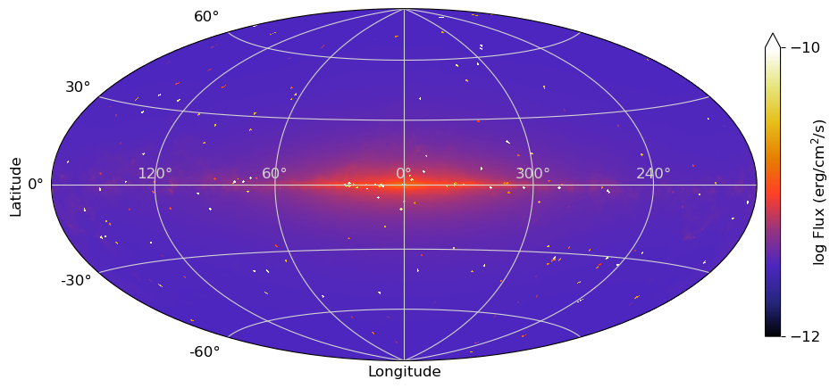 |  |  |
| 2  | Olrando 2018 DRE | 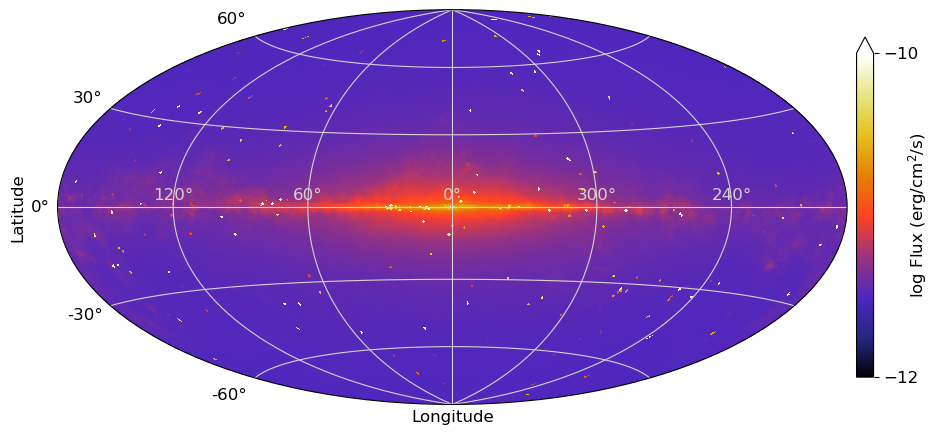 |  |  |
| 3  | Olrando 2018 DRELowV |  |  |  |
|   | **SMM** for CGB  |   |   |  COMPTEL is better in 10-100 MeV? | [total_allsky_2.zip](zip_total_SMMcgb/) |
| 1  | Ackermann+ 2012 | 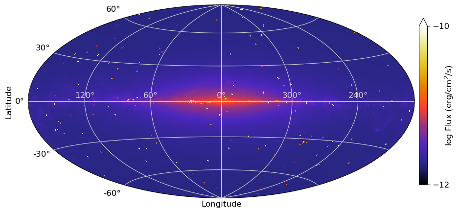 | 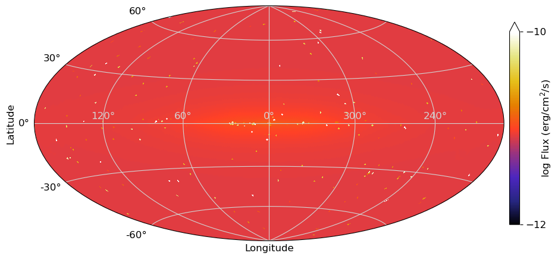 |  |
| 2  | Olrando 2018 DRE | 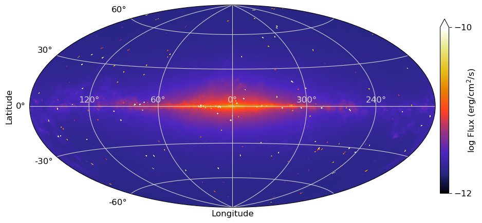 | 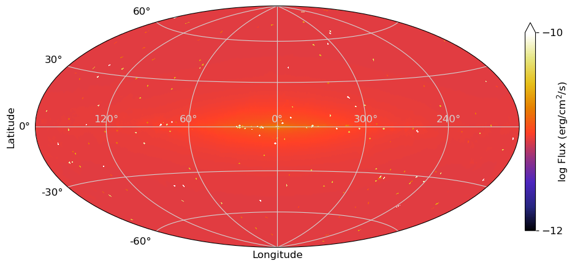 |  |
| 3  | Olrando 2018 DRELowV |  |  |  |

## Each component
| id | Notes | 1-10 MeV | 0.1-1 MeV | 10-100 MeV | FITS
| ---|---    | ---      | ---       | --- |---
|   | **Source**  |   |   |   |  [source.zip](zip_source/) |
| 1 | nside=64 | 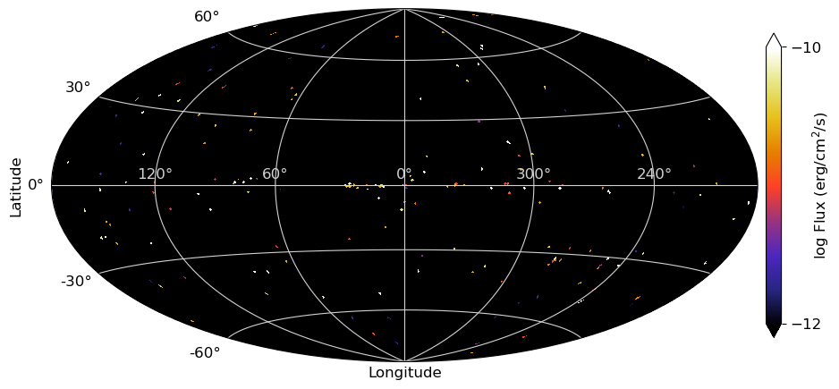 |  |   |
| 2 | nside=32 |  |  |  |
|   | **GDE**  |   |   |   | [GDE.zip](zip_GDE/) |
| 1  | Ackermann+ 2012 | 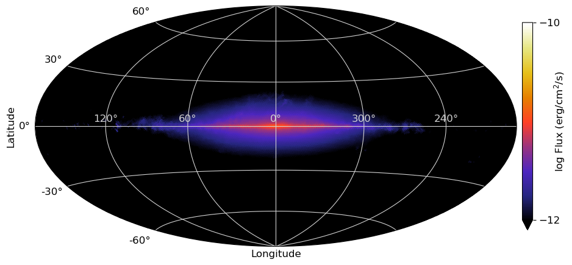 | 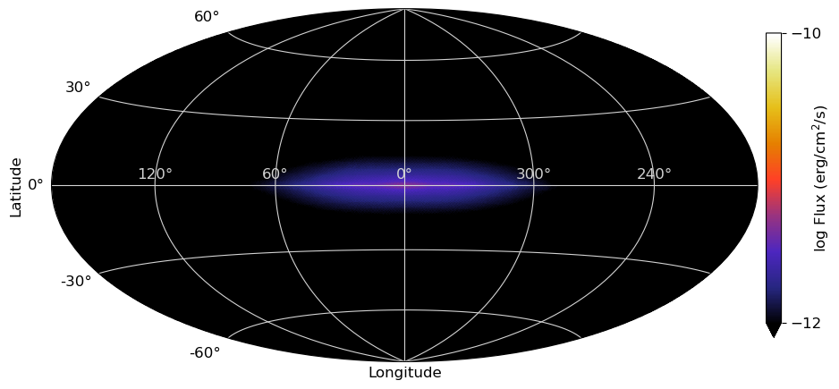 |  |
| 2  | Olrando 2018 DRE |  |  |  |
| 3  | Olrando 2018 DRELowV |  | 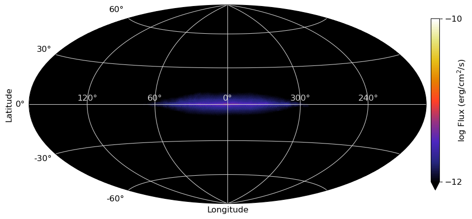 |  |
|   | **CGB**  |   |   |   | [CGB.zip](zip_CGB/) |
| 1 | COMPTEL |  |  | 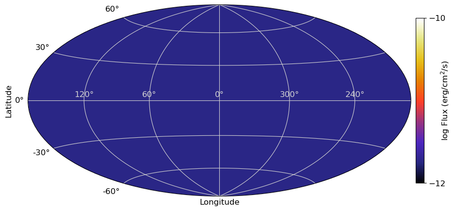|
| 2 | SMM |  |  |  COMPTEL is better in >10 MeV ? |

